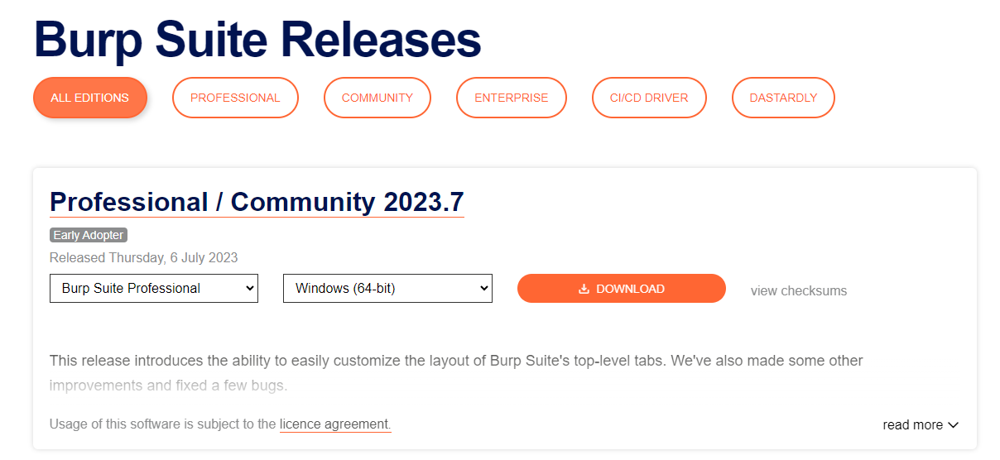

# Installation

Burp Suite is one of those tools that is very useful to have around, whether for web or mobile application assessments, pentesting, bug bounty hunting, or even debugging features in web app development. Here's a guide on installing Burp Suite on different platforms:

## Downloads

To download the latest version of Burp Suite for other systems, you may click this [button](https://portswigger.net/burp/releases/) to go to their download page.

**Kali Linux:** Burp Suite comes pre-installed with Kali Linux. In case it is missing on your Kali installation, you can easily install it from the Kali apt repositories.

**Linux, macOS, and Windows:** For other operating systems, PortSwigger provides dedicated installers for Burp Suite Community and Burp Suite Professional on the Burp Suite downloads page. Choose your operating system from the dropdown menu and select **Burp Suite Community Edition**. Then, click the **Download** button to initiate the download.

## Installation

Install Burp Suite using the appropriate method for your operating system. On Windows, run the executable file, while on Linux, execute the script from the terminal (with or without sudo). If you choose not to use `sudo` during installation on Linux, Burp Suite will be installed in your home directory at `~/BurpSuiteCommunity/BurpSuiteCommunity` and will not be added to your `PATH`.

The installation wizard provides clear instructions, and it is generally safe to accept the default settings. However, it is always recommended to review the installer carefully.

With Burp Suite successfully installed, you can now launch the application. In the next task, we will explore the initial setup and configuration.