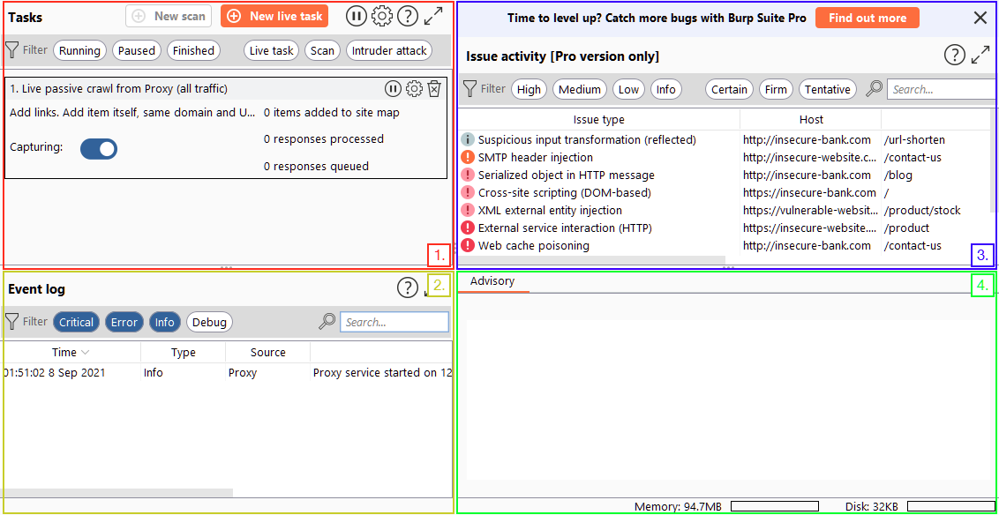

# Dashboard

Once you launch Burp Suite and accept the terms and conditions, you will be prompted to select a project type. In Burp Suite Community, the options are limited, and you can simply click **Next** to proceed.

The next window allows you to choose the configuration for Burp Suite. It is generally recommended to keep the default settings, which are suitable for most situations. Click **Start Burp** to open the main Burp Suite interface.

Upon opening Burp Suite for the first time, you might encounter a screen with training options. It is highly recommended to go through these training materials when you have the time.

If you don't see the training screen (or in subsequent sessions), you will be presented with the Burp Dashboard, which may seem overwhelming at first. However, it will soon become familiar.

The Burp Dashboard is divided into four quadrants, as labelled in counter-clockwise order starting from the top left:

1.  **Tasks**: The Tasks menu allows you to define background tasks that Burp Suite will perform while you use the application. In Burp Suite Community, the default “Live Passive Crawl” task, which automatically logs the pages visited, is sufficient for our purposes in this module. Burp Suite Professional offers additional features like on-demand scans.
    
2.  **Event log**: The Event log provides information about the actions performed by Burp Suite, such as starting the proxy, as well as details about connections made through Burp.
    
3.  **Issue Activity**: This section is specific to Burp Suite Professional. It displays the vulnerabilities identified by the automated scanner, ranked by severity and filterable based on the certainty of the vulnerability.
    
4.  **Advisory**: The Advisory section provides more detailed information about the identified vulnerabilities, including references and suggested remediations. This information can be exported into a report. In Burp Suite Community, this section may not show any vulnerabilities.
    

Throughout the various tabs and windows of Burp Suite, you will notice question mark icons ().

Clicking on these icons opens a new window with helpful information specific to that section. These help icons are invaluable when you need assistance or clarification on a particular feature, so make sure to utilise them effectively.

By exploring the different tabs and functionalities of Burp Suite, you will gradually become familiar with its capabilities.