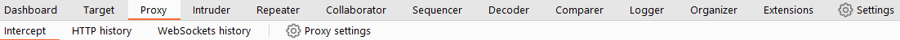
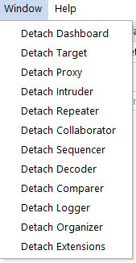

# Navigation

In Burp Suite, the default navigation is primarily done through the top menu bars, which allow you to switch between modules and access various sub-tabs within each module. The sub-tabs appear in a second menu bar directly below the main menu bar.

Here's how the navigation works:

1.  **Module Selection**: The top row of the menu bar displays the available modules in Burp Suite. You can click on each module to switch between them. For example, the Burp Proxy module is selected in the image below.
    
    
    
2.  **Sub-Tabs**: If a selected module has multiple sub-tabs, they can be accessed through the second menu bar that appears directly below the main menu bar. These sub-tabs often contain module-specific settings and options. For example, in the image above, the Proxy Intercept sub-tab is selected within the Burp Proxy module.
    
3.  **Detaching Tabs**: If you prefer to view multiple tabs separately, you can detach them into separate windows. To do this, go to the **Window** option in the application menu above the **Module Selection** bar. From there, choose the "Detach" option, and the selected tab will open in a separate window. The detached tabs can be reattached using the same method.

Burp Suite also provides keyboard shortcuts for quick navigation to key tabs. By default, the following shortcuts are available:

| Shortcut | Tab |
| :---: | :---: |
| `Ctrl + Shift + D` | Dashboard |
| `Ctrl + Shift + T` | Target tab |
| `Ctrl + Shift + P` | Proxy tab |
| `Ctrl + Shift + I` | Intruder tab |
| `Ctrl + Shift + R` | Repeater tab |