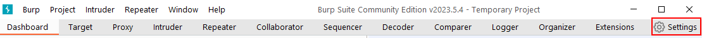
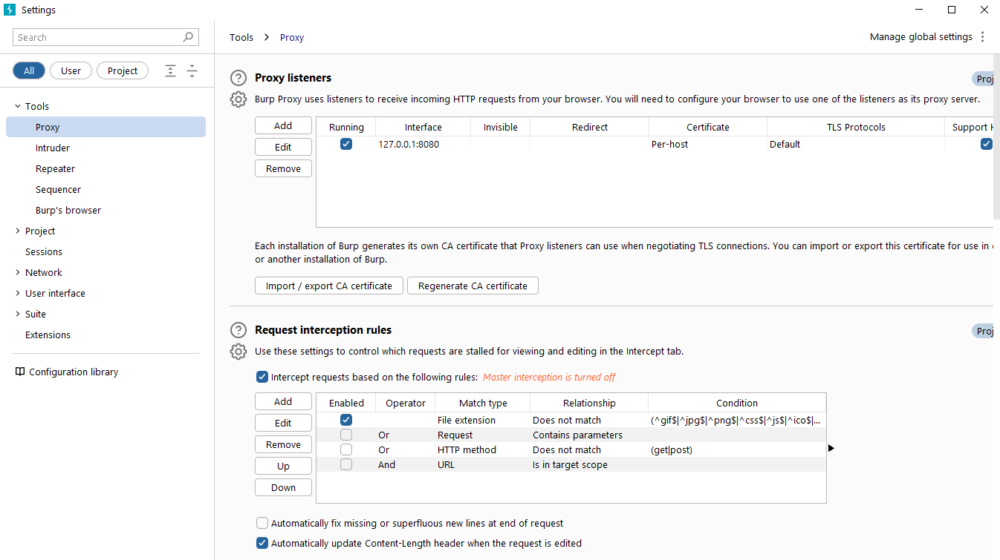
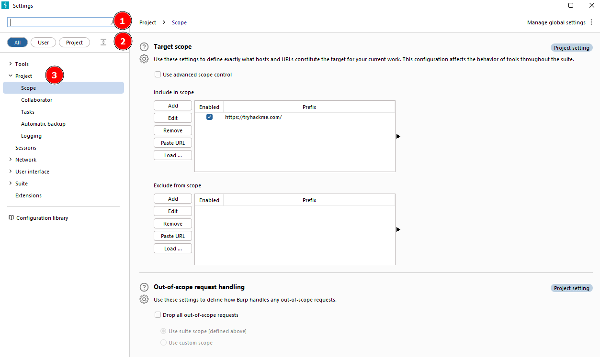
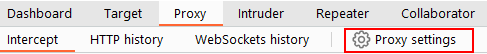

# Options

Before diving into the Burp Proxy, let's explore the available options for configuring Burp Suite. There are two types of settings: Global settings (also known as User settings) and Project settings.

- **Global Settings**: These settings affect the entire Burp Suite installation and are applied every time you start the application. They provide a baseline configuration for your Burp Suite environment.
    
- **Project Settings**: These settings are specific to the current project and apply only during the session. However, please note that Burp Suite Community Edition does not support saving projects, so any project-specific options will be lost when you close Burp.
    
    To access the settings, click on the **Settings** button in the top navigation bar. This will open a separate settings window.
    
    
    
    Below is the image showing the separate settings window.
    
    
    

In the Settings window, you will find a menu on the left-hand side. This menu allows you to switch between different types of settings, including:

1.  **Search**: Enables searching for specific settings using keywords.
2.  **Type filter**: Filters the settings for **User** and **Project** options.
    - **User settings**: Shows settings that affect the entire Burp Suite installation.
    - **Project settings**: Displays settings specific to the current project.
3.  **Categories**: Allows selecting settings by category.

It's worth noting that many tools within Burp Suite provide shortcuts to specific categories of settings. For example, the **Proxy** module includes a **Proxy settings** button that opens the settings window directly to the relevant proxy section.

The search feature on the settings page is a valuable addition, allowing you to quickly search for settings using keywords.

Take some time to familiarise yourself with the range of configurable options in Burp Suite. Once you are comfortable, you can proceed with the exercises related to configuring Burp Suite settings.