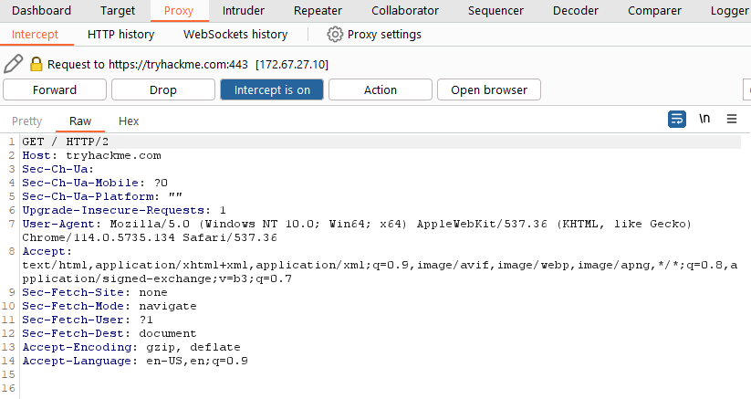
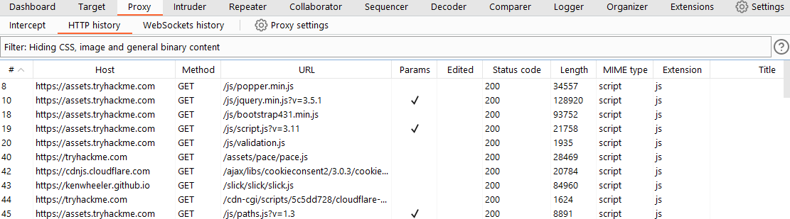
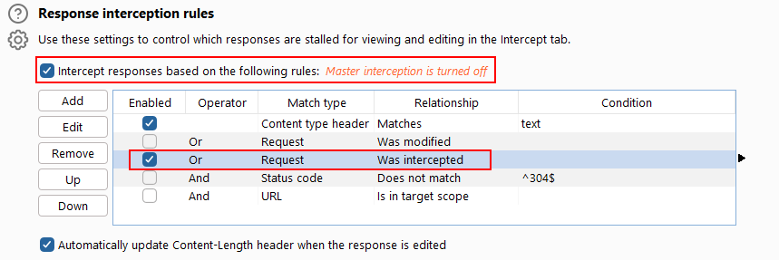

# Introduction to Proxy

The Burp Proxy is a fundamental and crucial tool within Burp Suite. It enables the capture of requests and responses between the user and the target web server. This intercepted traffic can be manipulated, sent to other tools for further processing, or explicitly allowed to continue to its destination.

&nbsp;

## Key Points to Understand About the Burp Proxy

- **Intercepting Requests:** When requests are made through the Burp Proxy, they are intercepted and held back from reaching the target server. The requests appear in the Proxy tab, allowing for further actions such as forwarding, dropping, editing, or sending them to other Burp modules. To disable the intercept and allow requests to pass through the proxy without interruption, click the `Intercept is on` button.
    
    
- **Taking Control:** The ability to intercept requests empowers testers to gain complete control over web traffic, making it invaluable for testing web applications.
    
- **Capture and Logging:** Burp Suite captures and logs requests made through the proxy by default, even when the interception is turned off. This logging functionality can be helpful for later analysis and review of prior requests.
    
- **WebSocket Support:** Burp Suite also captures and logs WebSocket communication, providing additional assistance when analysing web applications.
    
- **Logs and History:** The captured requests can be viewed in the **HTTP history** and **WebSockets history** sub-tabs, allowing for retrospective analysis and sending the requests to other Burp modules as needed.
    
    
    
    Proxy\-specific options can be accessed by clicking the **Proxy settings** button. These options provide extensive control over the Proxy’s behaviour and functionality. Familiarise yourself with these options to optimize your Burp Proxy usage.
    

## Some Notable Features in the Proxy Settings

- **Response Interception:** By default, the proxy does not intercept server responses unless explicitly requested on a per-request basis. The "Intercept responses based on the following rules" checkbox, along with the defined rules, allows for a more flexible response interception.
    
    
- **Match and Replace:** The "Match and Replace" section in the **Proxy settings** enables the use of regular expressions (regex) to modify incoming and outgoing requests. This feature allows for dynamic changes, such as modifying the user agent or manipulating cookies.
    

Take the time to explore and experiment with the Proxy options, as this will enhance your understanding and proficiency with the tool.