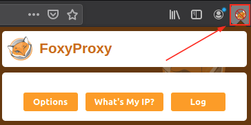
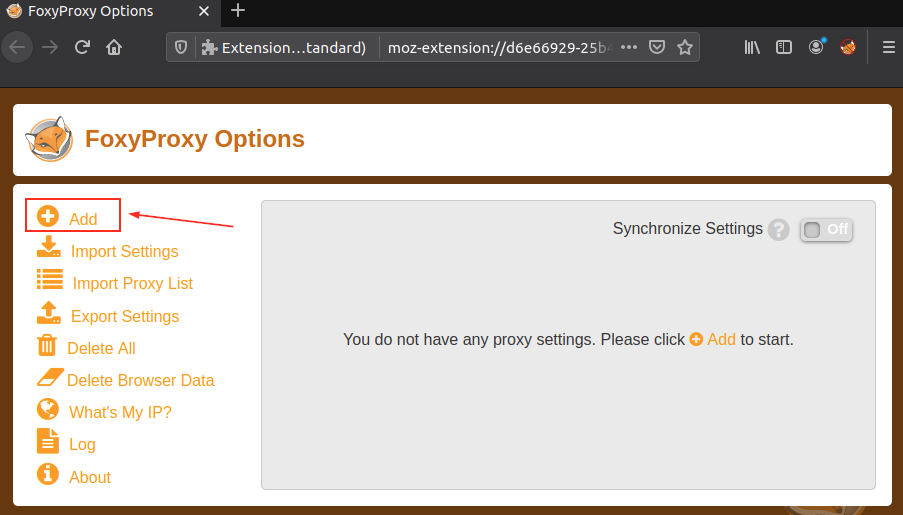
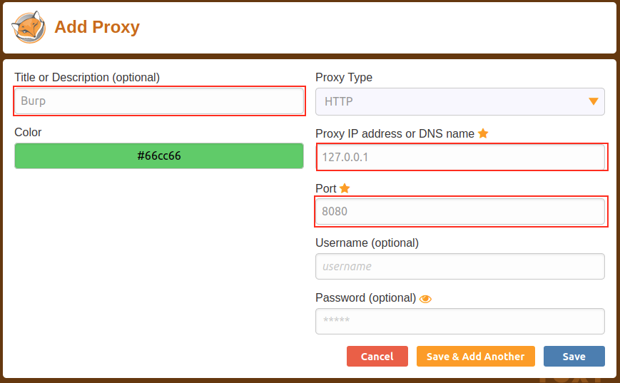
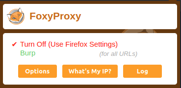
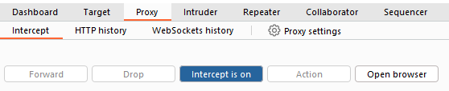

# Connecting through the Proxy (FoxyProxy)

To use the Burp Suite Proxy, we need to configure our local web browser to redirect traffic through Burp Suite. In this task, we will focus on configuring the proxy using the FoxyProxy extension in Firefox.

Please note that the instructions provided are specific to Firefox. If you are using a different browser, you may need to find alternative methods.

Here are the steps to configure the Burp Suite Proxy with FoxyProxy:

1.  **Install FoxyProxy:** Download and install the [FoxyProxy Basic extension](https://addons.mozilla.org/en-US/firefox/addon/foxyproxy-basic/).
    
2.  **Access FoxyProxy Options:** Once installed, a button will appear at the top right of the Firefox browser. Click on the FoxyProxy button to access the FoxyProxy options pop-up.
    
    
    
3.  **Create Burp Proxy Configuration:** In the FoxyProxy options pop-up, click the **Options** button. This will open a new browser tab with the FoxyProxy configurations. Click the **Add** button to create a new proxy configuration.
    
    
    
4.  **Add Proxy Details:** On the "Add Proxy" page, fill in the following values:
    
    - Title: `Burp` (or any preferred name)
    - Proxy IP: `127.0.0.1`\[the proxy machine IP/your machine IP\]
    - Port: `8080`
    
    
    
5.  **Save Configuration:** Click **Save** to save the Burp Proxy configuration.
    
6.  **Activate Proxy Configuration:** Click on the FoxyProxy icon at the top-right of the Firefox browser and select the `Burp` configuration. This will redirect your browser traffic through `127.0.0.1:8080`. Note that Burp Suite must be running for your browser to make requests when this configuration is activated.
    
    
    
7.  **Enable Proxy Intercept in Burp Suite:** Switch to Burp Suite and ensure that Intercept is turned on in the **Proxy** tab.
    
    
    
8.  **Test the Proxy:** Open Firefox and try accessing a website, such as the homepage for `http://MACHINE_IP/`. Your browser will hang, and the proxy will populate with the HTTP request. Congratulations, you have successfully intercepted your first request!
    

&nbsp;

## Remember the following:

- When the proxy configuration is active, and the intercept is switched on in Burp Suite, your browser will hang whenever you make a request.
- Be cautious not to leave the intercept switched on unintentionally, as it can prevent your browser from making any requests.
- Right-clicking on a request in Burp Suite allows you to perform various actions, such as forwarding, dropping, sending to other tools, or selecting options from the right-click menu.

Take note of these details as you begin using the Burp Suite Proxy.

**Note:** Consider closing the other tabs in the browser before enabling interception, as you will receive some WebSocket requests instead of request from the target.