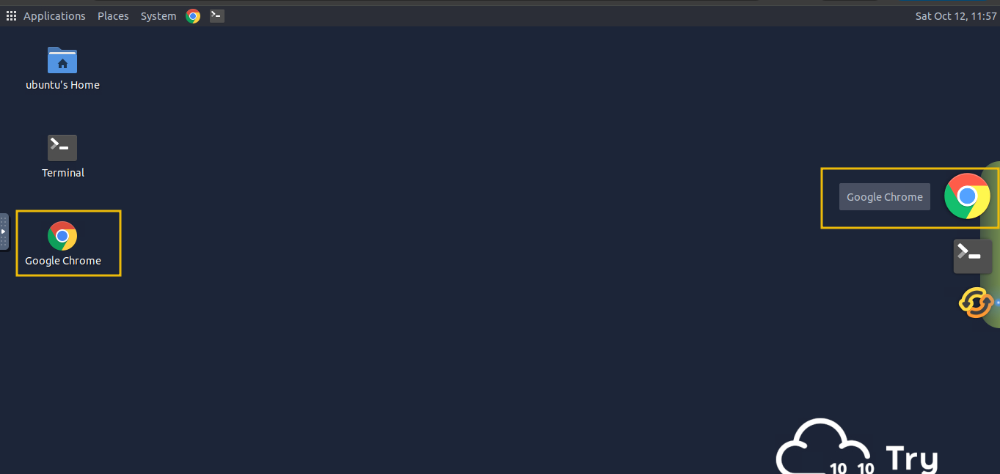
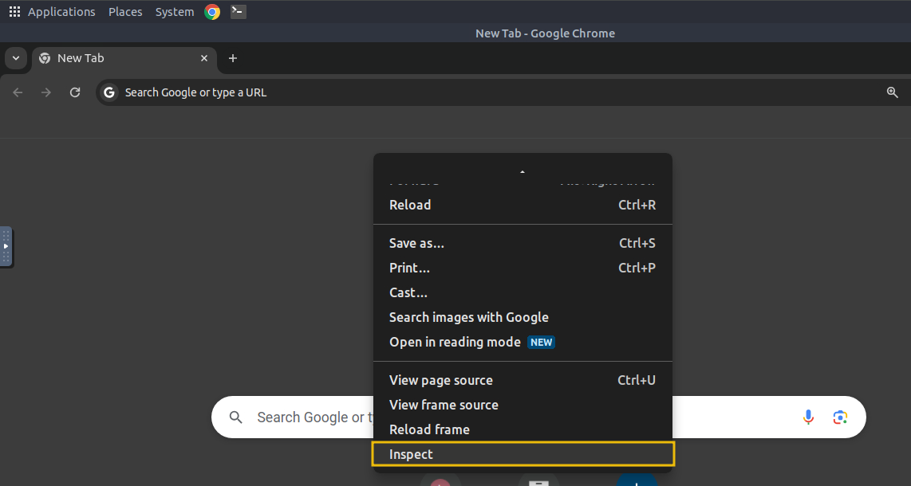
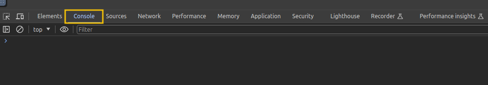
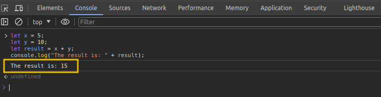

# JavaScript Overview

In this module, we’ll use JS to create our first program. JS is an **interpreted** language, meaning the code is executed directly in the browser without prior compilation. Below is a sample JS code demonstrating key concepts, such as **defining a variable**, **understanding data types**, **using control flow statements**, and writing simple functions. These essential building blocks help create more dynamic and interactive web apps. Don’t worry if it looks a bit new now - we will discuss each of these concepts in detail later on.

```javascript
 // Hello, World! program
console.log("Hello, World!");

// Variable and Data Type
let age = 25; // Number type

// Control Flow Statement
if (age >= 18) {
    console.log("You are an adult.");
} else {
    console.log("You are a minor.");
}

// Function
function greet(name) {
    console.log("Hello, " + name + "!");
}

// Calling the function
greet("Bob");
```

JS is primarily executed on the client side, which makes it easy to inspect and interact with HTML directly within the browser. We’ll use the `Google Chrome Console` feature to run our first JS program, allowing us to write and execute JS code easily without additional tools. Follow these steps to get started:

- Open `Google Chrome` by clicking the `Google Chrome` icon on the Desktop of the <span style="color: inherit;">VM</span>.



- Once Chrome is open, press `Ctrl + Shift + I` to open the `Console` or right-click anywhere on the page and select `Inspect`.



- Then, click on the `Console` tab. This console allows you to run JS code directly in the browser without installing additional software.



- Let's create a simple JS program that adds two numbers and displays the result. Below is the code:

```javascript
let x = 5;
let y = 10;
let result = x + y;
console.log("The result is: " + result);
```

- In the code above, `x` and `y` are variables holding the numbers. `x + y` is an expression that adds the two numbers together, whereas `console.log` is a function used to print the result to the console.
- Copy the above code and paste it into the console by pressing the key `Ctrl + V`. Once pasted, press `Enter`. You should see the result displayed as:



Congratulations! You’ve successfully created your first program in JS. This is just the beginning, and there’s much more to explore..