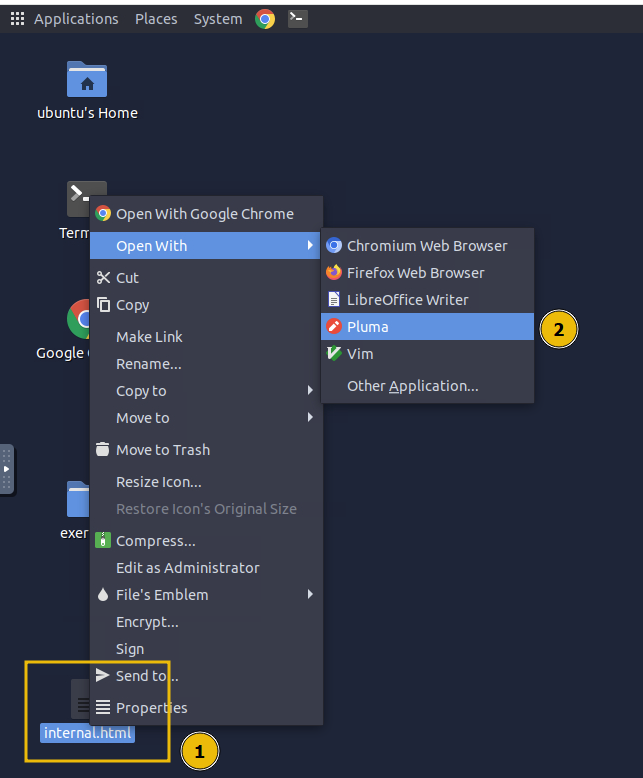
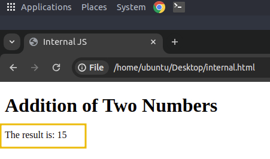
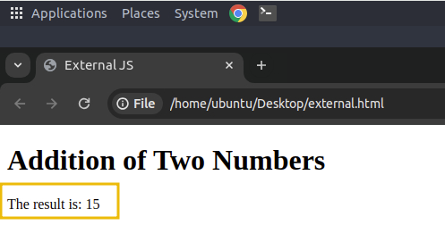
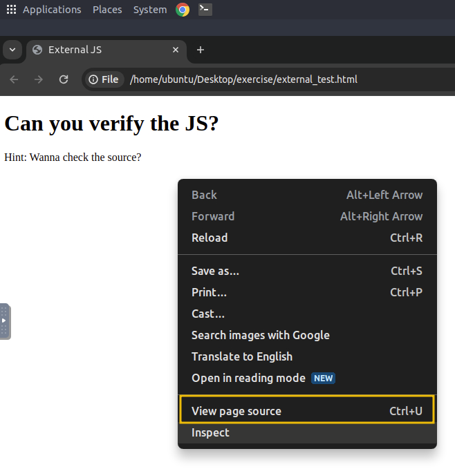
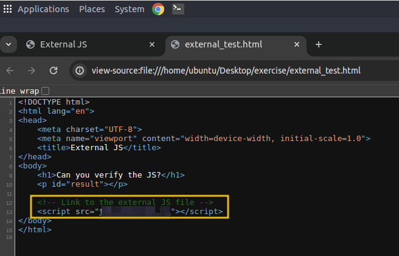
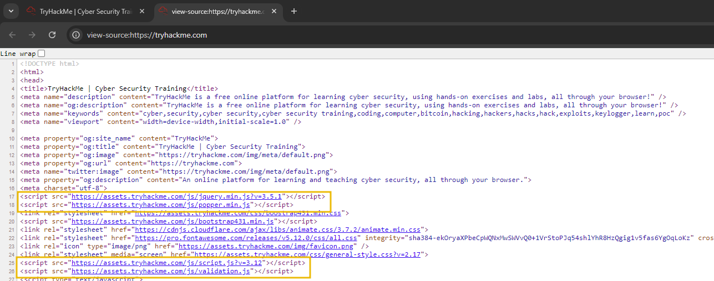

# Integrating JavaScript in HTML

This task assumes you have a basic understanding of HTML and its structure. This section will explore how JS can be integrated into HTML. Usually, JS is not used to render content; it works with HTML and CSS to create dynamic and interactive web pages. If you're unfamiliar with HTML, reviewing it through the [provided link](https://tryhackme.com/r/room/howwebsiteswork) is recommended. There are two main ways to integrate JS into HTML: internally and externally.

## Internal JavaScript

Internal JS refers to embedding the JS code directly within an HTML document. This method is preferable for beginners because it allows them to see how the script interacts with the HTML. The script is inserted between `<script>` tags. These tags can be placed inside the `<head>` section, typically used for scripts that need to be loaded before the page content is rendered, or inside the `<body>` section, where the script can be utilised to interact with elements as they are loaded on the web page.

### Example

To create an HTML document with internal JS, right-click on the `Desktop` and select `Create Document` > `Empty File`. Name the file `internal.html`. Next, right-click the `internal.html` file and `choose Open with Pluma` to open it in a text editor.



Once the editor is open, paste the following code:

```javascript
<!DOCTYPE html>
<html lang="en">
<head>
    <title>Internal JS</title>
</head>
<body>
    <h1>Addition of Two Numbers</h1>
    <p id="result"></p>

    <script>
        let x = 5;
        let y = 10;
        let result = x + y;
        document.getElementById("result").innerHTML = "The result is: " + result;
    </script>
</body>
</html>
```

After pasting the code, click `File` and select `Save`, which will save the file to `internal.html`.Double-click the file to open it in Chrome browser, where you will see the following output:



In this HTML document, we are using internal JS, meaning the code is placed directly inside the HTML file within the **&lt;script&gt;** tag. The script performs a simple task: it adds two numbers (x and y) and then displays the result on the web page. The JS interacts with the HTML by selecting an element (**&lt;p&gt; with id="result"**) and updating its content using `document.getElementById("result").innerHTML`. This internal JS is executed when the browser loads the HTML file.

&nbsp;

## External JavaScript

External JS involves creating and storing JS code in a separate file ending with a `.js` file extension. This method helps developers keep the HTML document clean and organised. The external JS file can be stored or hosted on the same web server as the HTML document or stored on an external web server such as the cloud.

We will use the same example for external JS but separate the JS code into a different file.

First, create a new file named `script.js` and save it on the `Desktop` with the following code:

```javascript
let x = 5;
let y = 10;
let result = x + y;
document.getElementById("result").innerHTML = "The result is: " + result;
```

Next, create a new file named `external.html` and paste the following code (notice that the HTML code is the same as that of the previous example):

```php
<!DOCTYPE html>
<html lang="en">
<head>
    <meta charset="UTF-8">
    <meta name="viewport" content="width=device-width, initial-scale=1.0">
    <title>External JS</title>
</head>
<body>
    <h1>Addition of Two Numbers</h1>
    <p id="result"></p>

    <!-- Link to the external JS file -->
    <script src="script.js"></script>
</body>
</html>
```

Now, double-click the external.html file and check the results. Do you see any difference? No, the output remains the same as in the previous example.



What we did differently is use the `src` attribute in the **&lt;script&gt;** tag to load the JS from an external file. When the browser loads the page, it looks for the `script.js` file and loads its content into the HTML document. This approach allows us to keep the JS code separate from the HTML, making the code more organised and easier to maintain, especially when working on larger projects.

&nbsp;

## Verifying Internal or External JS

When pen-testing a web application, it is important to check whether the website uses internal or external JS. This can be easily verified by viewing the page's source code. To do this, open the page `external_test.html` located in the `exercise` folder in `Chrome`, right-click anywhere on the page, and select `View Page Source`.



This will display the HTML code of the rendered page. Inside the source code, any JS written directly on the page will appear between **&lt;script&gt;** tags without the `src` attribute. If you see a **&lt;script&gt;** tag with a **src** attribute, it indicates that the page is loading external JS from a separate file.



For a practical example, visit [https://tryhackme.com](https://tryhackme.com/) in your browser and inspect the source code to identify how the website loads the JS internally and from external sources.

