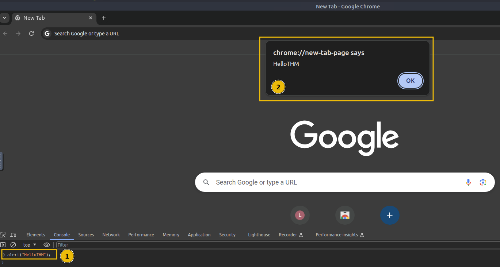
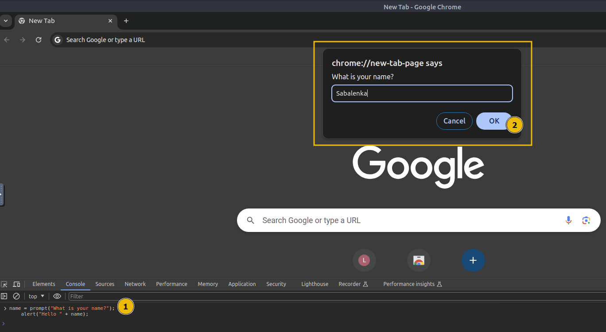
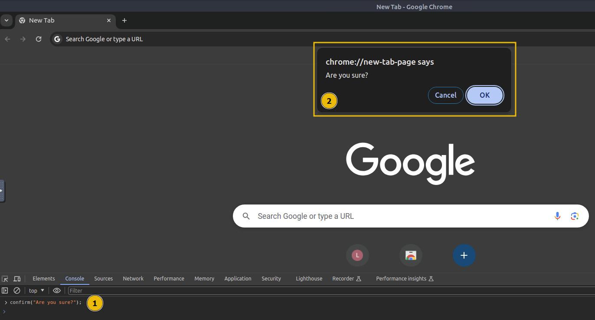
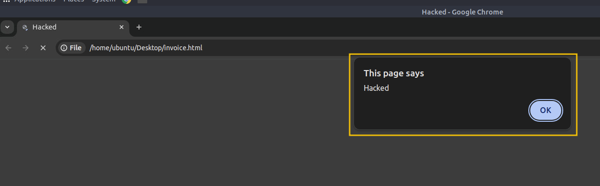

# Abusing Dialogue Functions

One of the main objectives of JS is to provide dialogue boxes for interaction with users and dynamically update content on web pages. JS provides built-in functions like `alert`, `prompt`, and `confirm` to facilitate this interaction. These functions allow developers to display messages, gather input, and obtain user confirmation. However, if not implemented securely, attackers may exploit these features to execute attacks like Cross-Site Scripting (XSS), which you will cover later in this module.

We will be using the `Google Chrome console` in the upcoming exercises.

&nbsp;

## Alert

The alert function displays a message in a dialogue box with an "`OK`" button, typically used to convey information or warnings to users. For example, if we want to display "`Hello THM`" to the user, we would use an `alert("HelloTHM");`. To try it out, open the Chrome console, type `alert("Hello THM")`, and press Enter. A dialogue box with the message will appear on the screen.



&nbsp;

## Prompt

The prompt function displays a dialogue box that asks the user for input. It returns the entered value when the user clicks "`OK`", or null if the user clicks "`Cancel`". For example, to ask the user for their name, we would use `prompt("What is your name?");`.

To test this, open the Chrome console and paste the following that asks for a username and then greets him.

```javascript
name = prompt("What is your name?");
    alert("Hello " + name);
```

Once you paste the code and hit Enter, a dialogue box will appear, and the value entered by the user will be returned to the console.



&nbsp;

## Confirm

The confirm function displays a dialogue box with a message and two buttons: "`OK`" and "`Cancel`". It returns true if the user clicks "`OK`" and false if the user clicks "`Cancel`". For example, to ask the user for confirmation, we would use `confirm("Are you sure?");`. To try this out, open the Chrome console, type `confirm("Do you want to proceed?")`, and press `Enter`.



A dialogue box will appear, and depending on whether the user clicks "`OK`" or "`Cancel`", the value true or false will be returned to the console.

&nbsp;

## How Hackers Exploit the Functionality

Imagine receiving an email from a stranger with an attached HTML file. The file looks harmless, but when you open it, it contains JS that disrupts your browsing experience. For example, the following code will show an alert box with the message "**Hacked**" three times:

```javascript
<!DOCTYPE html>
<html lang="en">
<head>
    <title>Hacked</title>
</head>
<body>
    <script>
        for (let i = 0; i < 3; i++) {
            alert("Hacked");
        }
    </script>
</body>
</html>
```

On the Desktop, create a file called `invoice.html` and paste the above code. Double-click the file to open it, and the alert message will pop up three times, causing an undesired experience.



Imagine if a bad actor sent you a similar file, but instead of displaying the alert three times, the number is set to **500**. You would be forced to keep closing the alert boxes one after another. This is a simple example of how malicious JS can be used to create an inconvenience or worse. Therefore, ensuring you only execute JS files from trusted sources is crucial to avoid such an undesired experience.