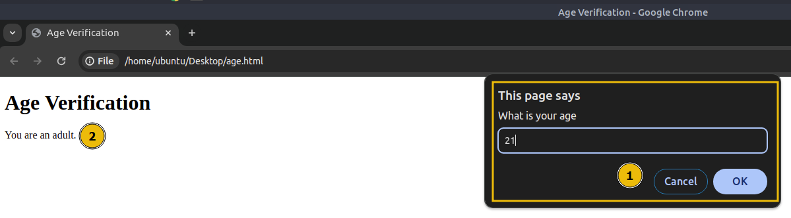
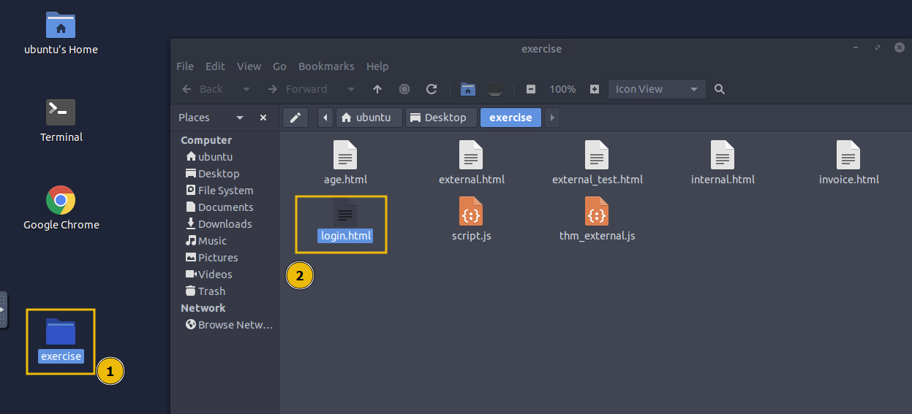
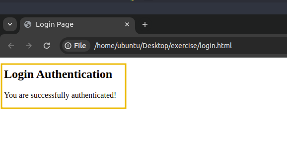

# Bypassing Control Flow Statements

Control flow in JS refers to the order in which statements and code blocks are executed based on certain conditions. JS provides several control flow structures such as `if-else`, `switch` statements to make decisions, and loops like `for`, `while`, and `do...while` to repeat actions. Proper use of control flow ensures that a program can handle various conditions effectively.

&nbsp;

## Conditional Statements in Action

One of the most used conditional statements is the `if-else` statements, which allows you to execute different blocks of code depending on whether a condition evaluates to `true` or `false`.

To test this practically, let's create a file `age.html` on the Desktop and paste the following code:

```javascript
<!DOCTYPE html>
<html lang="en">
<head>
    <title>Age Verification</title>
</head>
<body>
    <h1>Age Verification</h1>
    <p id="message"></p>

    <script>
        age = prompt("What is your age")
        if (age >= 18) {
            document.getElementById("message").innerHTML = "You are an adult.";
        } else {
            document.getElementById("message").innerHTML = "You are a minor.";
        }
    </script>
</body>
</html>
```

Double-click the file to open it in Google Chrome. You will see the following image:



In the above code, a prompt will ask for your age. If your age is greater than or equal to 18, it will display a message saying, "`You are an adult.`" Otherwise, it will show a different message. This behaviour is controlled by the if-else statement, which checks the value of the age variable and displays the appropriate message based on the condition.

&nbsp;

## Bypassing Login Forms

Suppose a developer has implemented authentication functionality in JS, where only users with the username "`admin`" and passwords matching a specific value are allowed to log in. To see this in action, open the `login.html` file in the exercises folder.

```html
<!DOCTYPE html>
<html lang="en">
<head>
    <title>Login Page</title>
</head>
<body>
    <h2>Login Authentication</h2>

    <script>
        let username = prompt("Enter your username:");
        let password = prompt("Enter your password:");

        if (username === "admin" && password === "ComplexPassword") {
            document.write("You are successfully authenticated!");
        } else {
            document.write("Authentication failed. Incorrect username or password.");
        }
    </script>
</body>
</html>
```



When you double-click the file and open it in your browser, it will prompt you for a username and password. If the correct credentials are entered, it will display a message confirming that you are logged in, as shown below:

