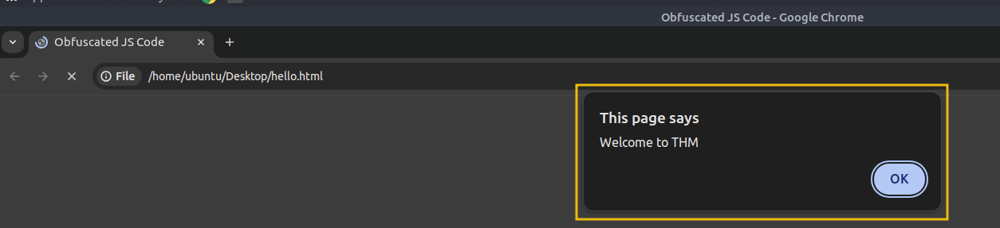
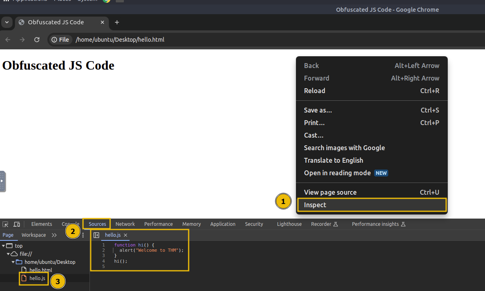
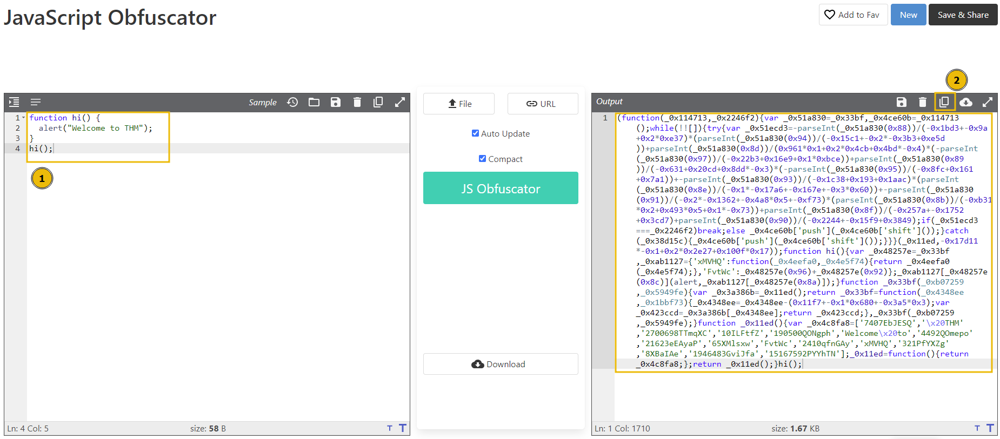
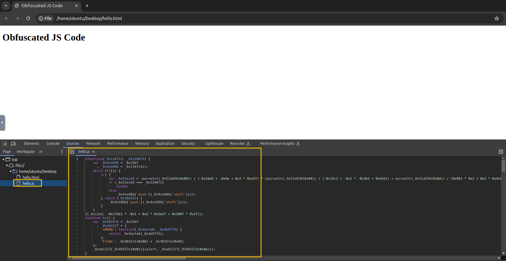
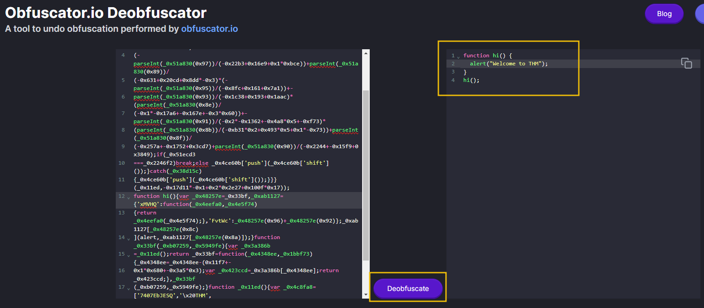

# Exploring Minified Files

We have understood how JS works and how we can read it until now, but what if the file is not human-readable and has been **minified**?

Minification in JS is the process of compressing JS files by removing all unnecessary characters, such as spaces, line breaks, comments, and even shortening variable names. This helps reduce the file size and improves the loading time of web pages, especially in production environments. Minified files make the code more compact and harder to read for humans, but they still function exactly the same.

Similarly, **obfuscation** is often used to make JS harder to understand by adding undesired code, renaming variables and functions to meaningless names, and even inserting dummy code.

&nbsp;

## Practical Example

Create a file on the Desktop of the attached <span style="color: inherit;">VM</span> with the name `hello.html` and paste the following HTML code:

```javascript
<!DOCTYPE html>
<html lang="en">
<head>
    <title>Obfuscated JS Code</title>
</head>
<body>
    <h1>Obfuscated JS Code</h1>
    <script src="hello.js"></script>
</body>
</html>
```

Then, create another file with the name `hello.js` and add the following code:

```javascript
function hi() {
  alert("Welcome to THM");
}
hi();
```

Now, double-click the `hello.html` file to open it in Google Chrome. Once the file is opened, you will see an alert greeting you with "`Welcome to THM`".



Click `OK` to close the alert dialogue box. Right-click anywhere on the page and click on `Inspect` to open the developer tools. In the developer tools, navigate to the `Sources` tab and click on the `hello.js` file to view the source code. You will see that the JS code is easily accessible and viewable, as shown below:



&nbsp;

## Obfuscation in Action

Now, we will try to minify and obfuscate the JS code using an online tool. Visit the [website](https://codebeautify.org/javascript-obfuscator) and copy the contents of `hello.js`, and paste them into the dialogue box on the website. The tool will minify and obfuscate the code, turning it into a string of gibberish characters shown below:



But what if we tell you that these gibberish characters are still fully functional code? The only difference is that they are not human-readable, but the browser can still execute them correctly. The website converted our JS code to this one:

```javascript
(function(_0x114713,_0x2246f2){var _0x51a830=_0x33bf,_0x4ce60b=_0x114713();while(!![]){try
{var _0x51ecd3=-parseInt(_0x51a830(0x88))/(-0x1bd3+-0x9a+0x2*0xe37)*(parseInt(_0x51a830(0x94))/
(-0x15c1+-0x2*-0x3b3+0xe5d))+parseInt(_0x51a830(0x8d))/(0x961*0x1+0x2*0x4cb+0x4bd*-0x4)*
(-parseInt(_0x51a830(0x97))/(-0x22b3+0x16e9+0x1*0xbce))+parseInt(_0x51a830(0x89))/
(-0x631+0x20cd+0x8dd*-0x3)*(-parseInt(_0x51a830(0x95))/(-0x8fc+0x161+0x7a1))+-
parseInt(_0x51a830(0x93))/(-0x1c38+0x193+0x1aac)*(parseInt(_0x51a830(0x8e))/
(-0x1*-0x17a6+-0x167e+-0x3*0x60))+-parseInt(_0x51a830(0x91))/(-0x2*-0x1362+-0x4a8*0x5+-0xf73)*
(parseInt(_0x51a830(0x8b))/(-0xb31*0x2+0x493*0x5+0x1*-0x73))+parseInt(_0x51a830(0x8f))/
(-0x257a+-0x1752+0x3cd7)+parseInt(_0x51a830(0x90))/(-0x2244+-0x15f9+0x3849);if(_0x51ecd3
===_0x2246f2)break;else _0x4ce60b['push'](_0x4ce60b['shift']());}catch(_0x38d15c)
{_0x4ce60b['push'](_0x4ce60b['shift']());}}}(_0x11ed,-0x17d11*-0x1+0x2*0x2e27+0x100f*0x17));
function hi(){var _0x48257e=_0x33bf,_0xab1127={'xMVHQ':function(_0x4eefa0,_0x4e5f74)
{return _0x4eefa0(_0x4e5f74);},'FvtWc':_0x48257e(0x96)+_0x48257e(0x92)};_0xab1127[_0x48257e(0x8c)
](alert,_0xab1127[_0x48257e(0x8a)]);}function _0x33bf(_0xb07259,_0x5949fe){var _0x3a386b
=_0x11ed();return _0x33bf=function(_0x4348ee,_0x1bbf73){_0x4348ee=_0x4348ee-(0x11f7+-
0x1*0x680+-0x3a5*0x3);var _0x423ccd=_0x3a386b[_0x4348ee];return _0x423ccd;},_0x33bf
(_0xb07259,_0x5949fe);}function _0x11ed(){var _0x4c8fa8=['7407EbJESQ','\x20THM',
'2700698TTmqXC','10ILFtfZ','190500QONgph','Welcome\x20to',
'4492QOmepo','21623eEAyaP','65XMlsxw','FvtWc','2410qfnGAy','xMVHQ','321PfYXZg',
'8XBaIAe','1946483GviJfa','15167592PYYhTN'];_0x11ed=function(){return _0x4c8fa8;};return _0x11ed();}hi();
```

Click the `Copy to Clipboard` (highlighted as **2** in the above image) button as shown on the website. Then, remove the current content of `hello.js` on the attached VM and paste the obfuscated content into the file.

Reload the `hello.html` file in Google Chrome and inspect the source code again under the `Sources` tab. You will notice that the code is now obfuscated but still functions exactly the same as before.



&nbsp;

## Deobfuscating a Code

We can also deobfuscate an obfuscated code using an online tool. Visit the [website](https://obf-io.deobfuscate.io/), then paste the obfuscated code into the provided dialogue box. The website will generate the equivalent, human-readable JS code for you, making it easier to understand and analyze the original script.



You have seen how easily we deobfuscated and retrieved our original code.