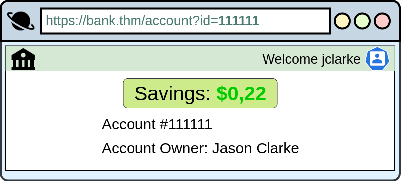

# Insecure Direct Object Reference

**IDOR** or **Insecure Direct Object Reference** refers to an access control vulnerability where you can access resources you wouldn't ordinarily be able to see. This occurs when the programmer exposes a Direct Object Reference, which is just an identifier that refers to specific objects within the server. By object, we could mean a file, a user, a bank account in a banking application, or anything really.

Insecure Direct Object Reference (IDOR) is a vulnerability that occurs when an application exposes internal objects (such as database records, files, or account details) without proper access control. This allows an attacker to modify or access data that they shouldn’t have access to, often by changing a URL, API request, or input parameter.

For example, let's say we're logging into our bank account, and after correctly authenticating ourselves, we get taken to a URL like this `https://bank.thm/account?id=111111`. On that page, we can see all our important bank details, and a user would do whatever they need to do and move along their way, thinking nothing is wrong.

There is, however, a potentially huge problem here, anyone may be able to change the `id` parameter to something else like `222222`, and if the site is incorrectly configured, then he would have access to someone else's bank information.

The application exposes a direct object reference through the `id` parameter in the URL, which points to specific accounts. Since the application isn't checking if the logged-in user owns the referenced account, an attacker can get sensitive information from other users because of the IDOR vulnerability. Notice that direct object references aren't the problem, but rather that the application doesn't validate if the logged-in user should have access to the requested account.

&nbsp;

## Why is IDOR Dangerous?

- IDOR can **lead to data breaches**, unauthorized account access, or even full system compromise.
- Attackers can **view, edit, or delete data** they shouldn't have access to.
- It is **easy to exploit** and often requires **no special tools**—just a web browser or API client like Postman.
- IDOR attacks have been involved in **major data breaches**, affecting millions of users.

&nbsp;

## How Does IDOR Work?

A web application usually **references internal objects (e.g., user accounts, order IDs, document files) using predictable identifiers**, such as:

- **User IDs** (`user_id=123`)
- **Order numbers** (`order=456`)
- **File paths** (`/documents/file789.pdf`)

If the application **does not verify user permissions**, an attacker can **manipulate these references** to access unauthorized data.

&nbsp;

## **IDOR Attack Examples**

### 1\. Unauthorized Access to Another User’s Profile

**Scenario:** A web app allows users to view their profile by accessing:  
`https://example.com/user/profile?user_id=123`

**Attack:** An attacker changes the `user_id` to another user’s ID:  
`https://example.com/user/profile?user_id=124`

❌ If the application does not check whether the user is authorized, the attacker gains access to another user’s private profile.

**Fix:**

- Use **session-based authentication** instead of passing `user_id` in the URL.
- Check on the server-side whether the logged-in user owns the requested profile.

* * *

### 2\. Accessing Another User’s Order Details

**Scenario:** A shopping website allows users to check their order status using:  
`https://example.com/orders/5678`

**Attack:** The attacker changes `5678` to another order ID:  
`https://example.com/orders/5679`

❌ If the app does not verify ownership, the attacker can view another user’s order details, including address and payment info.

**Fix:**

- Validate that the request belongs to the authenticated user.
- Use **random, unpredictable order IDs (UUIDs)** instead of sequential numbers.

* * *

### 3\. Bypassing Access Controls in APIs

**Scenario:** A mobile app fetches a user’s messages via an API:  
`GET /api/messages?message_id=2345`

**Attack:** An attacker intercepts the request and modifies `message_id`:  
`GET /api/messages?message_id=2346`

❌ If the API does not verify permissions, the attacker can read someone else's private messages.

**Fix:**

- Ensure API requests **always check ownership** on the server side.
- Use **OAuth or token-based authentication** instead of exposing direct IDs.

* * *

### 4\. Downloading Someone Else’s Private Files

**Scenario:** A user downloads their invoice from:  
`https://example.com/invoices/invoice123.pdf`

**Attack:** The attacker changes the filename:  
📌 `https://example.com/invoices/invoice124.pdf`

❌ If access controls are not enforced, the attacker can download someone else’s invoice.

**Fix:**

- Store files with **randomized names (e.g., hash-based names)** instead of sequential names.
- Require authentication and **check file ownership** before serving the file.

* * *

## How to Prevent IDOR Attacks

### 1\. Enforce Proper Authorization on the Server Side

- Never trust user input; always verify that a request **belongs to the authenticated user**.
- Use **session-based or token-based authentication** instead of passing user IDs in URLs.

### 2\. Avoid Direct Object References in URLs

- Use **UUIDs (Universally Unique Identifiers)** instead of predictable numeric IDs.
- Example:  
    ✅ `https://example.com/orders/d3b07384d113edec49eaa6238ad5ff00`  
    ❌ `https://example.com/orders/5678`

### 3\. Implement Role-Based Access Control (RBAC)

- Assign **roles and permissions** to restrict user access.
- Example:
    - Users can only view their own data.
    - Admins have elevated privileges.

### 4\. Secure APIs with Proper Authorization Checks

- Always validate **if the request is from the rightful owner**.
- Example:
    - If a user requests `GET /api/account/1001`, verify they **own account 1001**.

### 5\. Monitor and Log Unauthorized Access Attempts

- Log all **failed access attempts** and set up alerts for suspicious activity.
- Example:
    - If a user **requests multiple different `user_id`s**, **flag** it as a potential IDOR attack.

### 6\. Use Access Control Libraries and Frameworks

- If using **Django, Express.js, or Spring Boot**, use built-in **authentication and permission controls**.
- Example:
    - **Spring Security**: `@PreAuthorize("hasRole('USER') and #id == authentication.principal.id")`

* * *

## How to Test for IDOR Vulnerabilities

### 1\. Manual Testing

- **Modify object references (IDs, filenames, API parameters) in URLs or requests**.
- Check if you can **access another user's data**.

### 2\. Use Security Testing Tools

- **Burp Suite** – Intercept and modify requests.
- **OWASP ZAP** – Scan for IDOR vulnerabilities.
- **Postman** – Manually send API requests with altered parameters.

### 3\. Automate Testing in CI/CD Pipelines

- Use **static (SAST) and dynamic (DAST) security scanners**.
- Implement **automated security testing** with tools like OWASP Dependency-Check.

* * *

## Conclusion

**IDOR is a simple but dangerous vulnerability** that can expose sensitive data or allow unauthorized modifications. It occurs when applications **rely on user-controlled object references without proper authorization checks**. To prevent IDOR attacks:

- Implement **server-side authorization checks**.
- Avoid **predictable object references** (use UUIDs).
- Use **secure API authentication**.
- Monitor **suspicious access attempts**.