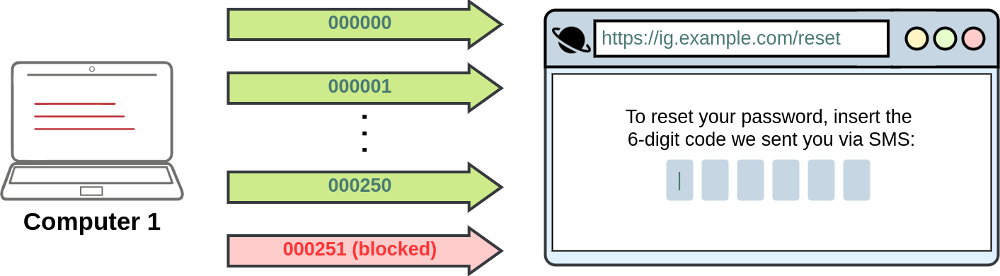
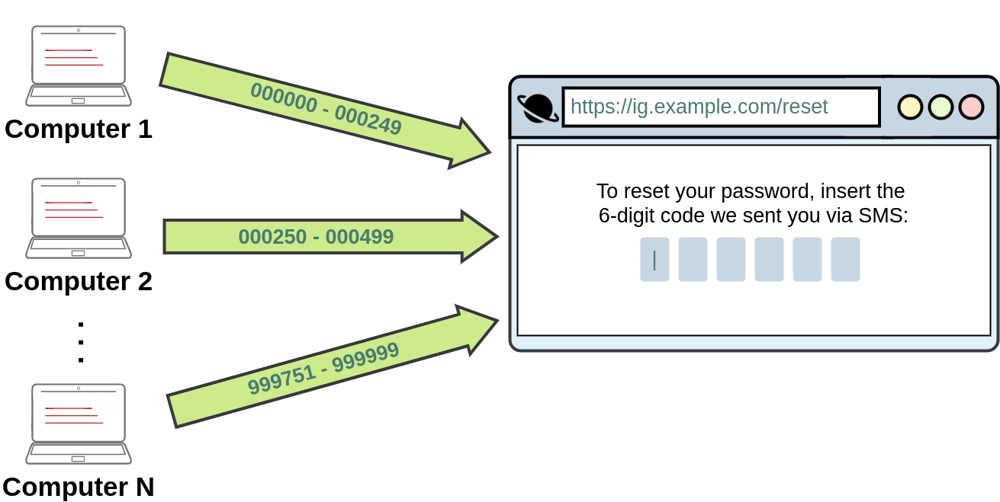

# Insecure Design

**Insecure design** refers to vulnerabilities which are inherent to the application's architecture. They are not vulnerabilities regarding bad implementations or configurations, but the idea behind the whole application (or a part of it) is flawed from the start. Most of the time, these vulnerabilities occur when an improper threat modelling is made during the planning phases of the application and propagate all the way up to your final app. Some other times, insecure design vulnerabilities may also be introduced by developers while adding some "shortcuts" around the code to make their testing easier. A developer could, for example, disable the OTP validation in the development phases to quickly test the rest of the app without manually inputting a code at each login but forget to re-enable it when sending the application to production.

## Why is Insecure Design a Problem?

1.  **Difficult to Fix** – Once an application is built with an insecure design, addressing security flaws may require **significant rework** rather than simple patches.
2.  **Introduces Business Logic Vulnerabilities** – Attackers can manipulate application workflows, such as bypassing payment processes or escalating privileges.
3.  **Leads to Security Debt** – Organizations that ignore security in the design phase accumulate technical and security debt, leading to **high costs and risks in the long run**.
4.  **Not Solvable by Firewalls or Patching Alone** – Unlike software vulnerabilities (e.g., SQL Injection), insecure design issues often **require architectural changes**.

&nbsp;

## Insecure Password Resets

A good example of such vulnerabilities occurred on [Instagram a while ago](https://thezerohack.com/hack-any-instagram). Instagram allowed users to reset their forgotten passwords by sending them a 6-digit code to their mobile number via SMS for validation. If an attacker wanted to access a victim's account, he could try to brute-force the 6-digit code. As expected, this was not directly possible as Instagram had rate-limiting implemented so that after 250 attempts, the user would be blocked from trying further.

However, it was found that the rate-limiting only applied to code attempts made from the same IP. If an attacker had several different IP addresses from where to send requests, he could now try 250 codes per IP. For a 6-digit code, you have a million possible codes, so an attacker would need 1000000/250 = 4000 IPs to cover all possible codes. This may sound like an insane amount of IPs to have, but cloud services make it easy to get them at a relatively small cost, making this attack feasible.

Notice how the vulnerability is related to the idea that no user would be capable of using thousands of IP addresses to make concurrent requests to try and brute-force a numeric code. The problem is in the design rather than the implementation of the application in itself.

Since insecure design vulnerabilities are introduced at such an early stage in the development process, resolving them often requires rebuilding the vulnerable part of the application from the ground up and is usually harder to do than any other simple code-related vulnerability. The best approach to avoid such vulnerabilities is to perform threat modelling at the early stages of the development lifecycle. To get more information on how to implement secure development lifecycles, be sure to check out the [SSDLC room](https://tryhackme.com/room/securesdlc).

&nbsp;

## Examples of Insecure Design

### 1\. Insufficient Authorization Logic

- A financial application allows users to withdraw money without verifying if they own the account.
- Attackers exploit weak logic to access or modify data that should be restricted.

### 2\. Missing Rate-Limiting or Abuse Prevention

- A login system allows unlimited password attempts without rate limiting.
- A ticket booking site allows bots to buy up all tickets before real users can.

### 3\. Weak Multi-Factor Authentication (MFA) Implementation

- An application forces MFA for some users but allows an attacker to bypass it by directly accessing API endpoints.

### 4\. Lack of Secure Session Management

- Sessions do not expire properly, allowing attackers to reuse session tokens indefinitely.
- No automatic logout after inactivity, leaving sessions open to hijacking.

### 5\. Flawed Business Logic Attacks

- An e-commerce site allows users to apply the same discount coupon multiple times, leading to financial loss.
- A banking application does not verify transaction limits, allowing unauthorized fund transfers.

* * *

## How to Prevent Insecure Design

### 1\. Implement Secure Design Principles

- Follow secure development frameworks like **OWASP ASVS (Application Security Verification Standard)**.
- Use **Threat Modeling** to identify security weaknesses before implementation.
- Apply **Principle of Least Privilege (PoLP)** to limit user access.

### 2\. Conduct Security Reviews During Development

- Perform **Secure Code Reviews** and **Architecture Reviews**.
- Use **Secure SDLC (Software Development Lifecycle)** methodologies like **DevSecOps**.

### 3\. Use Strong Authentication and Authorization

- Implement **multi-factor authentication (MFA)** correctly.
- Enforce **role-based access control (RBAC)** and proper **session management**.

### 4\. Implement Rate Limiting and Abuse Detection

- Set up **API rate limiting** to prevent brute-force attacks.
- Use **bot detection and CAPTCHA** to prevent automated abuse.

### 5\. Perform Security Testing

- Conduct **penetration testing** to find design flaws before attackers do.
- Use automated security scanning tools like **OWASP ZAP** and **Burp Suite**.

* * *

## Conclusion

**Insecure Design** is one of the biggest security risks because it creates **deeply embedded vulnerabilities** that are **hard to fix**. The best way to avoid it is to integrate **security at every stage of the development process**, from planning to deployment.