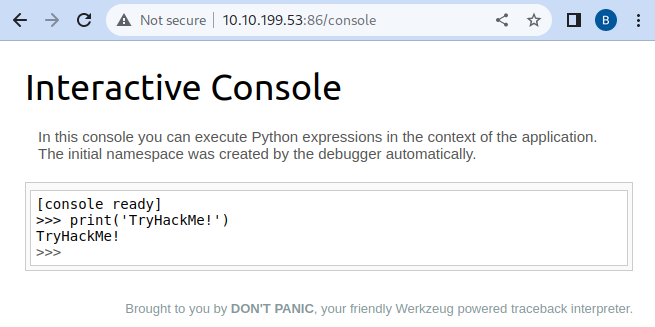

# Security Misconfiguration

Security Misconfigurations are distinct from the other Top 10 vulnerabilities because they occur when security could have been appropriately configured but was not. Even if you download the latest up-to-date software, poor configurations could make your installation vulnerable. It often happens due to **default settings, incomplete security hardening, or a failure to follow best practices** in configuration management.

Security misconfigurations include:

- Poorly configured permissions on cloud services, like S3 buckets.
- Having unnecessary features enabled, like services, pages, accounts or privileges.
- Default accounts with unchanged passwords.
- Error messages that are overly detailed and allow attackers to find out more about the system.
- Not using [HTTP security headers](https://owasp.org/www-project-secure-headers/).

This vulnerability can often lead to more vulnerabilities, such as default credentials giving you access to sensitive data, XML External Entities (XXE) or command injection on admin pages.

Misconfigurations can exist at multiple levels, including:

- Web servers
- Databases
- Cloud services
- APIs
- Application frameworks
- Security settings in software or infrastructure

For more info, look at the [OWASP top 10 entry for Security Misconfiguration](https://owasp.org/Top10/A05_2021-Security_Misconfiguration/).

### Why is Security Misconfiguration Dangerous?

- **Attackers Can Exploit Default or Weak Configurations** – Many systems come with **default credentials** or settings that are not secure.
- **Data Leakage** – Misconfigured cloud storage (e.g., AWS S3, Azure Blob) can expose **sensitive information** to the public.
- **Increased Attack Surface** – Unused features (e.g., unnecessary services, open ports) **provide more opportunities for attackers**.
- **Privilege Escalation** – Weak security settings may allow attackers to gain **unauthorized access** or **elevate privileges**.
- **Lack of Logging and Monitoring** – Without proper logging, **attacks can go undetected**, leading to **delayed incident response**.

## Debugging Interfaces

A common security misconfiguration concerns the exposure of debugging features in production software. Debugging features are often available in programming frameworks to allow the developers to access advanced functionality that is useful for debugging an application while it's being developed. Attackers could abuse some of those debug functionalities if somehow, the developers forgot to disable them before publishing their applications.

One example of such a vulnerability was allegedly used when [Patreon got hacked in 2015](https://labs.detectify.com/2015/10/02/how-patreon-got-hacked-publicly-exposed-werkzeug-debugger/). Five days before Patreon was hacked, a security researcher reported to Patreon that he had found an open debug interface for a Werkzeug console. Werkzeug is a vital component in Python-based web applications as it provides an interface for web servers to execute the Python code. Werkzeug includes a debug console that can be accessed either via URL on `/console`, or it will also be presented to the user if an exception is raised by the application. In both cases, the console provides a Python console that will run any code you send to it. For an attacker, this means he can execute commands arbitrarily.

## Examples of Security Misconfigurations

### 1\. Using Default Credentials

- Many applications come with **default usernames and passwords** (e.g., `admin/admin`, `root/root`).
- Attackers can easily guess or look up these credentials in **public databases of known defaults**.

**Real-World Example:**

- **Mirai Botnet (2016):** Exploited default passwords on IoT devices to create a massive botnet for DDoS attacks.

### 2\. Unnecessary Features Enabled

- **Directory listing enabled:** Attackers can **browse directories** and download sensitive files.
- **Debug mode left enabled in production:** Exposes application internals, making it easier for attackers to exploit vulnerabilities.
- **Exposed admin panels:** Attackers can access the **control panel** without authentication.

**Real-World Example:**

- **2018 Tesla Cloud Breach:** Attackers exploited an **unprotected Kubernetes dashboard** to gain access to Tesla’s cloud computing resources.

### 3\. Misconfigured Cloud Storage

- **Publicly accessible S3 buckets** or **Azure Blob storage** exposing sensitive data.
- **No encryption enabled for stored data**, making it easier for hackers to read stolen files.

**Real-World Example:**

- **Capital One Data Breach (2019):** Misconfigured AWS S3 bucket exposed **100+ million customers’ data**.

### 4\. Improper Permissions and Access Control

- **Overly permissive API access:** APIs allow unauthorized users to access or modify data.
- **No least privilege enforcement:** Users have **more permissions than necessary**, increasing risk if an account is compromised.
- **Misconfigured CORS (Cross-Origin Resource Sharing):** Allows **unauthorized websites** to access API data.

**Real-World Example:**

- **Facebook Data Leak (2019):** Misconfigured APIs exposed **hundreds of millions of user records**.

### 5\. Insecure HTTP Headers

- **Missing security headers** (e.g., `X-Frame-Options`, `Content-Security-Policy`) leave the application vulnerable to attacks like **clickjacking, XSS, and CSRF**.
- **Allowing weak SSL/TLS configurations** makes the site vulnerable to **man-in-the-middle (MitM) attacks**.

### 6\. Unpatched or Outdated Software

- Running **outdated software with known vulnerabilities** (e.g., outdated CMS, libraries, frameworks).
- Not **removing old versions** of software that are still accessible to attackers.

**Real-World Example:**

- **Equifax Breach (2017):** Attackers exploited an **unpatched vulnerability in Apache Struts**, exposing **147 million records**.

* * *

## How to Prevent Security Misconfigurations

### 1\. Secure Configuration Management

- Use **security hardening guides** (e.g., CIS Benchmarks, OWASP Secure Configuration Guide).
- Regularly review and **harden server, application, and database settings**.
- Disable **unnecessary features and services**.

### 2\. Enforce Least Privilege Access

- Implement **Role-Based Access Control (RBAC)**.
- Ensure APIs and cloud services **only allow necessary access**.
- Restrict database and system permissions **to the minimum required level**.

### 3\. Implement Secure Default Settings

- Change **default credentials immediately**.
- Enforce **strong authentication mechanisms** (e.g., MFA).
- Set **secure default permissions** when deploying new applications.

### 4\. Automate Configuration Management

- Use **Infrastructure as Code (IaC)** tools (e.g., Terraform, Ansible) to enforce **secure configurations** consistently.
- Regularly scan for **misconfigurations using security tools** (e.g., AWS Config, Microsoft Defender for Cloud).

### 5\. Secure Cloud Storage and Services

- **Disable public access** to S3 buckets, Azure Blobs, and other storage services.
- Enable **encryption for data at rest and in transit**.
- Use **identity-based access controls** instead of relying on public access keys.

### 6\. Regular Security Audits & Penetration Testing

- Conduct **regular security assessments** to detect misconfigurations.
- Use **automated security scanners** like:
    - **OWASP ZAP** – Web application security scanning.
    - **Nmap** – Network scanning for open ports and misconfigurations.
    - **OpenVAS** – Vulnerability assessment.
    - **AWS Security Hub / Azure Security Center** – Cloud security checks.

### 7\. Proper Logging & Monitoring

- Enable **detailed logging** of authentication attempts, API calls, and system access.
- Use **SIEM (Security Information and Event Management)** tools (e.g., Splunk, ELK) to detect anomalies.

* * *

## Conclusion

Security misconfigurations are one of the most common yet preventable vulnerabilities in modern IT environments. **By following secure configuration best practices, enforcing least privilege, automating security checks, and conducting regular security audits, organizations can significantly reduce their attack surface.**