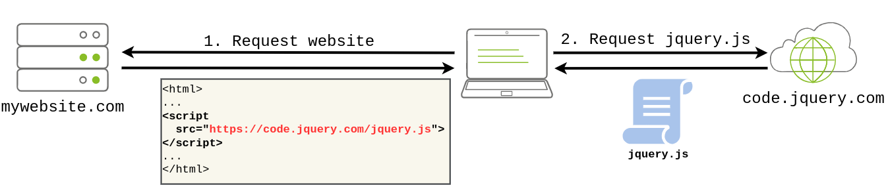

# Software Integrity Failures

Software integrity failures occur when applications, updates, or critical software components are **not properly validated**, allowing attackers to introduce **malicious code, tamper with data, or compromise software supply chains**. These failures arise when **software updates, dependencies, or configuration files** are **not securely verified**, leading to security risks such as **unauthorized modifications, backdoor installations, and malware injections**.

### Why Are Software Integrity Failures Dangerous?

1.  **Supply Chain Attacks** – Attackers inject malicious code into software packages before they reach users.
2.  **Unauthorized Code Execution** – Applications can run unverified or modified code, leading to remote code execution.
3.  **Tampered Software Updates** – Attackers can hijack insecure update mechanisms to distribute malware.
4.  **Data Corruption and Manipulation** – Lack of integrity checks allows unauthorized data changes, leading to fraudulent transactions or system failures.
5.  **Exploitation of CI/CD Pipelines** – Compromised build processes can introduce vulnerabilities across an entire software ecosystem.

&nbsp;

Suppose you have a website that uses third-party libraries that are stored in some external servers that are out of your control. While this may sound a bit strange, this is actually a somewhat common practice. Take as an example jQuery, a commonly used javascript library. If you want, you can include jQuery in your website directly from their servers without actually downloading it by including the following line in the HTML code of your website:

```html
<script src="https://code.jquery.com/jquery-3.6.1.min.js"></script>
```

When a user navigates to your website, its browser will read its HTML code and download jQuery from the specified external source.



The problem is that if an attacker somehow hacks into the jQuery official repository, they could change the contents of `https://code.jquery.com/jquery-3.6.1.min.js` to inject malicious code. As a result, anyone visiting your website would now pull the malicious code and execute it into their browsers unknowingly. This is a software integrity failure as your website makes no checks against the third-party library to see if it has changed. Modern browsers allow you to specify a hash along the library's URL so that the library code is executed only if the hash of the downloaded file matches the expected value. This security mechanism is called Subresource Integrity (SRI), and you can read more about it [here](https://www.srihash.org/).

The correct way to insert the library in your HTML code would be to use SRI and include an integrity hash so that if somehow an attacker is able to modify the library, any client navigating through your website won't execute the modified version. Here's how that should look in HTML:

```html
<script src="https://code.jquery.com/jquery-3.6.1.min.js" integrity="sha256-o88AwQnZB+VDvE9tvIXrMQaPlFFSUTR+nldQm1LuPXQ=" crossorigin="anonymous"></script>
```

You can go to https://www.srihash.org/ to generate hashes for any library if needed.

&nbsp;

## Common Types of Software Integrity Failures

### 1\. Insecure Software Supply Chain

- Use of **compromised third-party libraries, plugins, or dependencies**.
- Attackers inject malicious code into **open-source projects or popular software packages**.
- Developers unknowingly integrate **backdoored software** into their applications.

**Example:**

- The **SolarWinds Supply Chain Attack (2020)** compromised over **18,000 organizations**, including **government agencies**, by injecting malware into **legitimate software updates**.

**Prevention Measures:**

- Use **trusted package repositories** (e.g., Maven Central, PyPI, npm).
- Implement **Software Bill of Materials (SBOM)** to track all dependencies.
- Regularly scan dependencies for **known vulnerabilities** using **SCA tools (e.g., Snyk, OWASP Dependency-Check, GitHub Dependabot).**

* * *

### 2\. Insecure Software Updates

- Applications download updates **without verifying their authenticity**.
- **Lack of cryptographic signing** allows attackers to replace legitimate updates with malicious versions.
- **Use of unencrypted HTTP for update delivery**, enabling **man-in-the-middle (MitM) attacks**.

**Example:**

- In 2017, the **NotPetya ransomware** spread through a **compromised software update** from Ukrainian tax software **M.E.Doc**, affecting **global enterprises**.

**Prevention Measures:**

- **Digitally sign** software updates using cryptographic signatures.
- Validate updates using **checksum verification (SHA-256, SHA-512).**
- Deliver updates over **secure channels (HTTPS, TLS 1.2/1.3).**

* * *

### 3\. Compromised CI/CD Pipelines

- Attackers inject malicious code into **build pipelines** by exploiting weak authentication mechanisms.
- **Unsigned or improperly signed builds** allow unauthorized modifications.
- Lack of **integrity checks in deployment processes** allows introduction of unauthorized code.

**Example:**

- Attackers gained access to **continuous integration (CI) servers** and injected **malicious code into production builds**, distributing **compromised software** to end users.

**Prevention Measures:**

- Use **code signing** to validate software integrity before deployment.
- Enforce **least privilege access** for build environments.
- Implement **immutable infrastructure** to prevent unauthorized changes.

* * *

### 4\. Unverified Data Integrity

- **Lack of cryptographic integrity checks** for **configuration files, databases, or transaction logs**.
- Attackers modify **financial transactions, audit logs, or sensitive records** without detection.
- Failure to detect **tampered or corrupted data** leads to security and compliance risks.

**Example:**

- Attackers modify **banking transaction logs** to **manipulate balances or hide fraudulent activity**.

**Prevention Measures:**

- Use **cryptographic hashing (SHA-256, HMAC) to verify data integrity**.
- Implement **tamper-proof logging mechanisms** with **audit trails**.
- Store logs and critical data in **append-only, blockchain-based, or write-once storage**.

&nbsp;

## How to Prevent Software Integrity Failures

### 1\. Secure the Software Supply Chain

- Use **trusted package managers** and repositories.
- Regularly **scan open-source dependencies** for vulnerabilities.
- Implement **Software Bill of Materials (SBOM)** to track software components.

### 2\. Ensure Secure Software Updates

- Use **code signing** to authenticate software updates.
- Deliver updates via **HTTPS and secure channels**.
- Verify update integrity using **checksums and cryptographic signatures**.

### 3\. Protect CI/CD Pipelines

- Enforce **strict access controls and least privilege** for build environments.
- Use **immutable infrastructure** to prevent unauthorized code modifications.
- Monitor **build logs and artifacts** for anomalies.

### 4\. Implement Cryptographic Integrity Checks

- Use **digital signatures and hashing** to validate software components.
- Implement **tamper-proof logging and audit trails**.
- Store critical data in **protected, append-only systems**.

* * *

## Conclusion

Software integrity failures expose applications to **supply chain attacks, unauthorized code execution, and data manipulation**. Organizations must **enforce cryptographic signing, secure update mechanisms, and protect CI/CD pipelines** to prevent these threats. By implementing **strict software integrity controls**, businesses can mitigate the risk of compromised software affecting their systems and users.