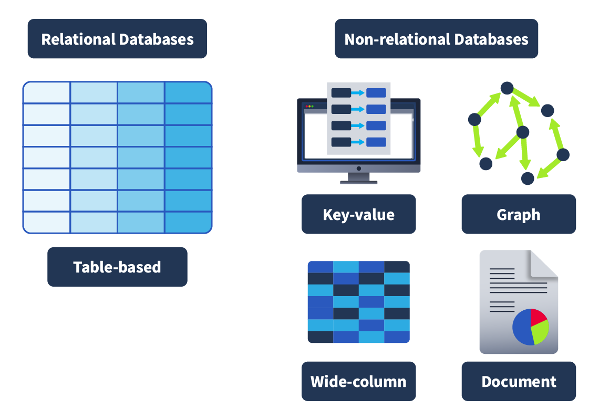

# Databases 101

As mentioned in the introduction, databases are so ubiquitous that you very likely interact with systems that are using them. Databases are an organised collection of structured information or data that is easily accessible and can be manipulated or analysed. That data can take many forms, such as user authentication data (such as usernames and passwords), which are stored and checked against when authenticating into an application or site (like TryHackMe, for example), user-generated data on social media (Like Instagram and Facebook) where data such as user posts, comments, likes etc are collected and stored, as well as information such as watch history which is stored by streaming services such as Netflix and used to generate recommendations.

I’m sure you get the point: databases are used extensively and can contain many different things. It’s not just massive-scale businesses that use databases. Smaller-scale businesses, when setting up, will almost certainly have to configure a database to store their data. Speaking of kinds of databases, let’s take a look now at what those are.

&nbsp;

## Different Types of Databases

Now it makes sense that something is used by so many and for (relatively) so long that there would be multiple types of implementations. There are quite a few different types of databases that can be built, but for this introductory room, we are going to focus on the two primary types: relational databases (aka SQL) vs non-relational databases (aka NoSQL).



An illustration comparing relational and non-relational databases. On the left, a relational database is shown with structured tables, rows, and columns, connected by relationships between tables. On the right, a non-relational database is depicted with flexible, unstructured data stored in formats like key-value pairs, documents, or collections, with no defined relationships between data points. The relational database emphasizes structured organization and data relationships, while the non-relational database highlights flexibility and scalability for diverse data types.

### Relational databases

Store structured data, meaning the data inserted into this database follows a structure. For example, the data collected on a user consists of first_name, last_name, email_address, username and password. When a new user joins, an entry is made in the database following this structure. This structured data is stored in rows and columns in a table (all of which will be covered shortly); relationships can then be made between two or more tables (for example, user and order_history), hence the term relational databases.

### Non-relational databases

Instead of storing data the above way, store data in a non-tabular format. For example, if documents are being scanned, which can contain varying types and quantities of data, and are stored in a database that calls for a non-tabular format. Here is an example of what that might look like:

```json
{
    _id: ObjectId("4556712cd2b2397ce1b47661"),
    name: { first: "Thomas", last: "Anderson" },
    date_of_birth: new Date('Sep 2, 1964'),
    occupation: [ "The One"],
    steps_taken : NumberLong(4738947387743977493)
}
```

In terms of what database should be chosen, it always comes down to the context in which the database is going to be used. Relational databases are often used when the data being stored is reliably going to be received in a consistent format, where accuracy is important, such as when processing e-commerce transactions. Non-relational databases, on the other hand, are better used when the data being received can vary greatly in its format but need to be collected and organised in the same place, such as social media platforms collecting user-generated content.

## Tables, Rows and Columns

Now that we’ve defined the two primary types of databases, we’ll focus on relational databases. We’ll start by explaining tables, rows, and columns. All data stored in a relational database will be stored in a table; for example, a collection of books in stock at a bookstore might be stored in a table named “Books”.


An illustration of a database table with rows and columns. The table has labeled columns at the top representing different data fields, such as 'ID', 'Name', and 'Published Date'. Each row below the headers contains data entries corresponding to these columns, forming individual records. The structure emphasizes how data is organized in a grid-like format, with each row representing a record and each column representing a specific attribute of the data.

When creating this table, you would need to define what pieces of information are needed to define a book record, for example, “id”, “Name”, and “Published_date”. These would then be your columns; when these columns are being defined, you would also define what data type this column should contain; if an attempt is made to insert a record into a database where the data type does not match, it is rejected. The data types that can be defined can vary depending on what database you are using, but the core data types used by all include Strings (a collection of words and characters), Integers (numbers), floats/decimals (numbers with a decimal point) and Times/Dates.

Once a table has been created with the columns defined, the first record would be inserted into the database, for example, a book named “Android Security Internals” with an id of “1” and a publication date of “2014-10-14”. Once inserted, this record would be represented as a row.

&nbsp;

# Primary and Foreign Keys

Once a table has been defined and populated, more data may need to be stored. For instance, we want to create a table named “Authors” that stores the authors of the books sold in the store. Here is a very clear example of a relationship. A book (stored in the Books table) is written by an author (stored in the Authors table). If we wanted to query for a book in our story but also have the author of that book returned, our data would need to be related somehow; we do this with keys. There are two types of keys:


An illustration comparing a Primary Key and a Foreign Key in database tables. On the left, a table is shown with a highlighted column labeled 'Primary Key,' which uniquely identifies each record in that table. On the right, another table is displayed with a highlighted column labeled 'Foreign Key,' which references the Primary Key from the first table. Arrows connect the Foreign Key to the Primary Key, emphasizing the relationship between the two tables, where the Foreign Key enforces referential integrity by linking related data across tables.

### Primary Keys

A primary key is used to ensure that the data collected in a certain column is unique. That is, there needs to be a way to identify each record stored in a table, a value unique to that record and is not repeated by any other record in that table. Think about matriculation numbers in a university; these are numbers assigned to a student so they can be uniquely identified in records (as sometimes students can have the same name). A column has to be chosen in each table as a primary key; in our example, “id” would make the most sense as an id has been uniquely created for each book where, as books can have the same publication date or (in rarer cases) book title. Note that there can only be one primary key column in a table.

### Foreign Keys

A foreign key is a column (or columns) in a table that also exists in another table within the database, and therefore provides a link between the two tables. In our example, think about adding an “author_id” field to our “Books” table; this would then act as a foreign key because the author_id in our Books table corresponds to the “id” column in the author table. Foreign keys are what allow the relationships between different tables in relational databases. Note that there can be more than one foreign key column in a table.