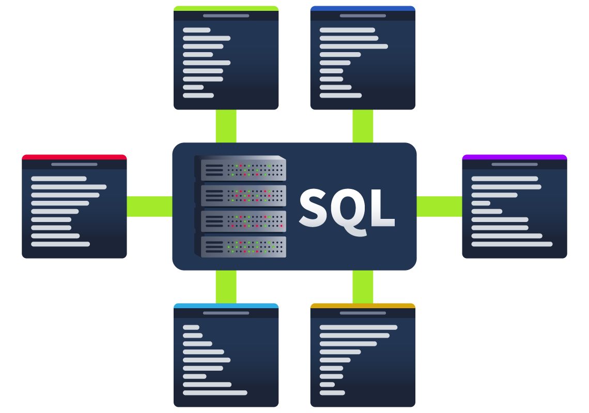

# SQL

How do databases work? How would you go and make your first table and populate it with data? What would you use? Databases are usually controlled using a Database Management System (DBMS). Serving as an interface between the end user and the database, a DBMS is a software program that allows users to retrieve, update and manage the data being stored. Some examples of DBMSs include MySQL, MongoDB, Oracle Database and Maria DB.



The interaction between the end user and the database can be done using <span style="color: inherit;">SQL</span> (Structured Query Language). <span style="color: inherit;">SQL</span> is a programming language that can be used to query, define and manipulate the data stored in a relational database.

## The Benefits of <span style="color: inherit;">SQL</span> and Relational Databases

<span style="color: inherit;">SQL</span> is almost as ubiquitous as databases themselves, and for good reason. Here are some of the benefits that come with learning and using to use <span style="color: inherit;">SQL</span>:

- **It's *fast*:** Relational databases (aka those that <span style="color: inherit;">SQL</span> is used for) can return massive batches of data almost instantaneously due to how little storage space is used and high processing speeds.
    
- **Easy to Learn:** Unlike many programming languages, <span style="color: inherit;">SQL</span> is written in plain English, making it much easier to pick up. The highly readable nature of the language means users can concentrate on learning the functions and syntax.
    
- **Reliable:** As mentioned before, relational databases can guarantee a level of accuracy when it comes to data by defining a strict structure into which data sets must fall in order to be inserted.
    
- **Flexible:** <span style="color: inherit;">SQL</span> provides all kinds of capabilities when it comes to querying a database; this allows users to perform vast data analysis tasks very efficiently.
    

&nbsp;

## Getting Hands ON

Now that we’ve covered what <span style="color: inherit;">SQL</span> is, it’s time to get hands-on and start using it yourself! 

### Setting up MySQL

```shell-session
user@BoB$ mysql -u root -p
```

Once prompted for the password, write it up. The output should look as follows:

```shell-session
user@BoB$ mysql -u root -p
Enter password: 
Welcome to the MySQL monitor.  Commands end with ; or \g.
Your MySQL connection id is 8
Server version: 8.0.39-0ubuntu0.20.04.1 (Ubuntu)

Copyright (c) 2000, 2024, Oracle and/or its affiliates.

Oracle is a registered trademark of Oracle Corporation and/or its
affiliates. Other names may be trademarks of their respective
owners.

Type 'help;' or '\h' for help. Type '\c' to clear the current input statement.

mysql> 
```

With that covered, you are ready to start using (and learning) <span style="color: inherit;">SQL</span>!