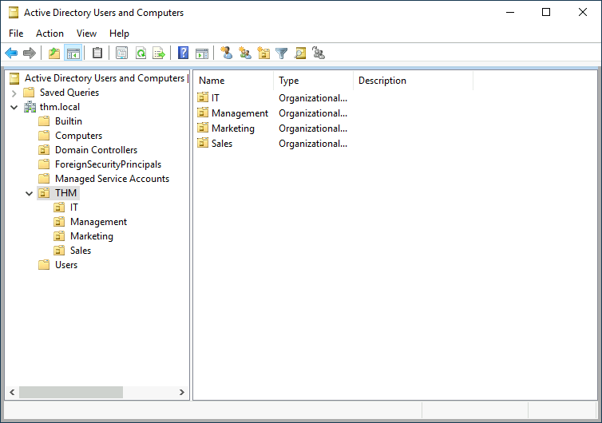
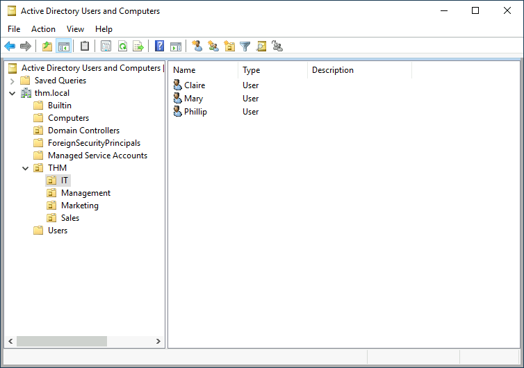

# Active Directory

The core of any Windows Domain is the Active Directory Domain Service (AD DS). This service acts as a catalogue that holds the information of all of the "object" that exist on a network. Amongst the many objects supported by AD, there are users, groups, machines, printers, shares, and many others.

&nbsp;

### Users

Users are one of the most common object types in Active Directory. Users are one of the objects known as security principals, meaning that they can be authenticated by the domain and can be assigned privileges over resources like files or printers. You could say that a security principal is an object that can act upon resources in the network.

Users can be used to represent two types of entities:

- **People:** users will generally represent persons in a organization that need to access the network, like employees.
- **Services:** users can also be defined to be used by services like IIS OR MSSQL. Evert single service requires a user to run, but service users are different from regular users as they will only have the privileges needed to run their specific service.

### Machines

Machines are another type of object within Active Directory; for every computer that joins the Active Directory domain, a machine object will be created. Machines are also considered "security principals" and are assigned an account just as any regular user. This account has somewhat limited rights within the domain itself.

The machine accounts themselves are local administrators on the assigned computer, they are generally not supposed to be accessed by anyone except the computer itself, but as with any other account, if you have a password, you can use it to log in.

**Note:** Machine Account passwords are automatically rotated out and are generally comprised of 120 random characters.

Identifying machine accounts is relatively easy. They follow a specific naming scheme. The machine account name is the computer's name followed by a dollar sign. For example, a machine named "DC01" will have a machine account called "DC01$".

### Security Groups

With Windows, user groups can be defined in order to assign access rights to files or other resources to entire groups instead of single users. This allows for better manageability as you can add users to an existing group, and they will automatically inherit all of the group's privileges. Security groups are also considered security principals and, therefore, can have privileges over resources on the network.

Groups can have both users and machines as members. If needed, groups can include other groups as well.

Several groups are created by default in a domain that can be used to grant specific privileges to users. As an example, here are some of the most important groups in a domain:

| **Security Group** | **Description** |
| --- | --- |
| Domain Admins | Users of this group have administrative privileges over the entire domain. By default, they can administer any computer on the domain, including the DCs. |
| Server Operators | Users in this group can administer Domain Controllers. They cannot change any administrative group memberships. |
| Backup Operators | Users in this group are allowed to access any file, ignoring their permissions. They are used to perform backups of data on computers. |
| Account Operators | Users in this group can create or modify other accounts in the domain. |
| Domain Users | Includes all existing user accounts in the domain. |
| Domain Computers | Includes all existing computers in the domain. |
| Domain Controllers | Includes all existing DCs on the domain. |

You can obtain the complete list of default security groups from the [Microsoft documentation](https://docs.microsoft.com/en-us/windows/security/identity-protection/access-control/active-directory-security-groups).

&nbsp;

## Active Directory Users and Computers

To configure users, groups or machines in Active Directory, the Domain Controller user needs to run "Active Directory Users and Computers".

&nbsp;  
  

This will open up a window that displays the hierarchy of users, computers and groups that exist in the domain. These objects are organized in Organizational Units (OUs) which are container objects that allow to classify users and machines. OUs are mainly used to define sets of users with similar policing requirements. The people in the Sales department of an organization are likely to have a different set of policies applied than the people in IT, for example. A user can only be a part of a single OU at a time.

### example

On this machine, there is an OU called THM with four child OUs for the IT, Management, Marketing, and Sales departments. It is very typical to see the OUs mimic the business' structure, as it allows for efficiently deploying baseline policies that apply to entire departments. While this would be the expected model most of the time, OUs can be defined arbitrarily. For example, you can right click the THM OU and create a new OU with whatever name it is wanted.

By opening any of the OUs, it will display the users they contain and allow to perform simple tasks like creating, deleting, or modifying them as needed. Also allowing to reset passwords if needed (pretty useful for the helpdesk)

There are other default containers apart from the THM OU. These containers are created automatically by Windows and contain the following:

- **Builtin:** Contains default groups available to any Windows host.
- **Computers:** Any machine joining the network will be put here by default. You can move them if needed.
- **Domain Controllers:** Default OU that contains the DCs in your network.
- **Users:** Default users and groups that apply to a domain-wide context.
- **Managed Service Accounts:** Holds accounts used by services in your Windows domain.

&nbsp;

## Security Groups vs Organizational Units

While both components are used to classify users and computers, their purposes are entirely different:

- Organizational Units are handy for applying policies to users and computers, which include specific configurations that pertain to sets of users depending on their particular role in the enterprise. A user can only be a member of a single OU at a time, as it wouldn't make sense to try to apply two different sets of policies to a single user.
- Security Groups, on the other hand, are used to grant permissions over resources. For example, you will use groups if you want to allow some users access to a shared folder or network printer. A user can be part of many groups, which is needed to grant access to multiple resources.