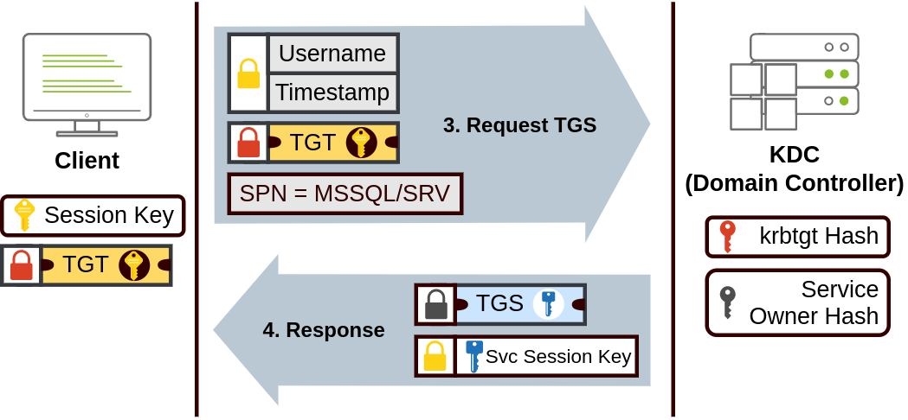

# Authentication Methods

When using Windows domains, all credentials are stored in the Domain Controllers. Whenever a user tries to authenticate to a service using domain credentials, the service will need to ask the Domain Controller to verify if they are correct. Two protocols can be used for network authentication in Windows domains:

- Kerberos: Used by any recent version of Windows. This is the current default protocol in any recent domain. Kerberos is a computer network authentication protocol that operates based on tickets, allowing nodes to securely prove their identity to one another over a non-secure network. It primarily aims at a client-server model and provides mutual authentication, where the user and the server verify each other's identity. The Kerberos protocol messages are protected against eavesdropping and replay attacks, and it builds on symmetric-key cryptography, requiring a trusted third party.
- NetNTLM: Legacy authentication protocol kept for compatibility purposes.

While NetNTLM should be considered obsolete, most networks will have both protocols enabled. Let's take a deeper look at how each of these protocols works.

&nbsp;

## Kerberos Authentication

Kerberos authentication is the default authentication protocol for any recent version of Windows. Users who log into a service using Kerberos will be assigned tickets. Think of tickets as proof of a previous authentication. Users with tickets can present them to a service to demonstrate they have already authenticated into a network before and are therefore enabled to use it.

When Kerberos is used for authentication, the following process happens:

### 1.

The user sends their username and a timestamp encrypted using a key derived from their password to the Key Distribution Center (KDC), a service usually installed on the Domain Controller in charge of creating Kerberos tickets on the network.

The KDC will create and send back a Ticket Granting Ticket (TGT), which will allow the user to request additional tickets to access specific services. The need for a ticket to get more tickets may sound a bit weird, but it allows users to request service tickets without passing their credentials every time they want to connect to a service. Along with the TGT, a Session Key is given to the user, which they will need to generate the following requests.

Notice the TGT is encrypted using the krbtgt account's password hash, and therefore the user can't access its contents. It is essential to know that the encrypted TGT includes a copy of the Session Key as part of its contents, and the KDC has no need to store the Session Key as it can recover a copy by decrypting the TGT if needed.

### 2.

When a user wants to connect to a service on the network like a share, website or database, they will use their TGT to ask for a Ticket Granting Service (TGS). TGS are tickets that allow connection only to the specific service they were created for. To request a TGS, the user will send their username and a timestamp encrypted using the Session Key, along with the TGT and a Service Principal Name (SPN), which indicates the service and server name we intend to access, to the KDC.

As a result, the KDC will send us a TGS along with a Service Session Key, which we will need to authenticate to the service we want to access. The TGS is encrypted using a key derived from the Service Owner Hash. The Service Owner is the user or machine account that the service runs under. The TGS contains a copy of the Service Session Key on its encrypted contents so that the Service Owner can access it  by decrypting the TGS.

### 3.

The TGS can then be sent to the desired service to authenticate and establish a connection. The service will use its configured account's password hash to decrypt the TGS and validate the Service Session Key.

&nbsp;

&nbsp;

## NetNTLM Authentication

NetNTLM works using a challenge-response mechanism. The entire process is as follows:

1.  The client sends an authentication request to the server they want to access.
2.  The server generates a random number and sends it as a challenge to the client.
3.  The client combines their NTLM password hash with the challenge (and other known data) to generate a response to the challenge and sends it back to the server for verification.
4.  The server forwards the challenge and the response to the Domain Controller for verification.
5.  The domain controller uses the challenge to recalculate the response and compares it to the original response sent by the client. If they match, the client is authenticated; otherwise, access is denied. The authentication result is sent back to the server.
6.  The server forwards the authentication result to the client.

Note that the user's password (or hash) is never transmitted through the network for security.

Note: The described process applies when using a domain account. If a local account is used, the server can verify the response to the challenge itself without requiring interaction with the domain controller since it has the password hash stored locally on its SAM.