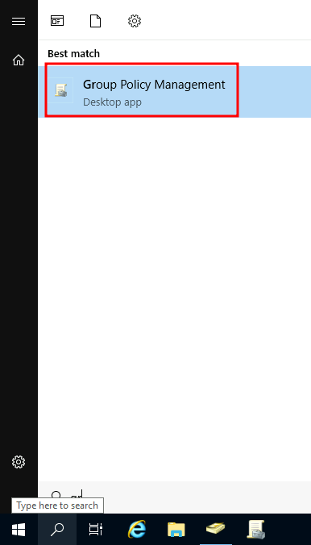
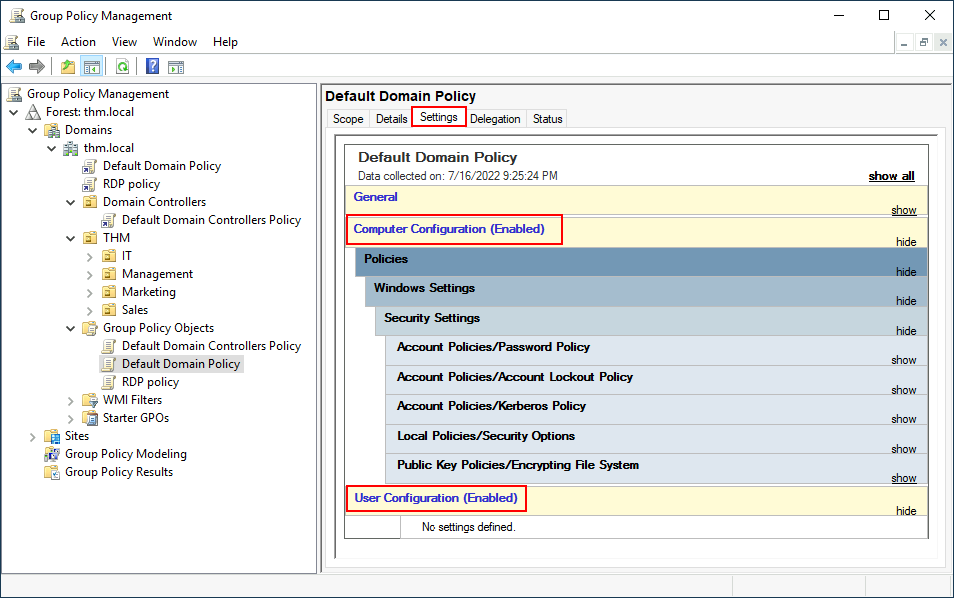

# Group Policies

This module will be following a practical example of an administrator managing an existing Active Directory

So far, we have organised users and computers in OUs just for the sake of it, but the main idea behind this is to be able to deploy different policies for each OU individually. That way, we can push different configurations and security baselines to users depending on their department.

Windows manages such policies through <span style="color: #2dc26b;">Group Policy Objects</span> (GPO). GPOs are simply a collection of settings that can be applied to OUs. GPOs can contain policies aimed at either users or computers, allowing to set a baseline on specific machines and identities.

To configure GPOs, the <span style="color: #2dc26b;">Group Policy Management</span> tool is used



At first it'll display the complete OU hierarchy. To configure Group Policies, create a <span style="color: #2dc26b;">Group Policy Object</span> under "**Group Policy Objects**" and link it to the OU to which the policies need to be applied. As an example, there are some already existing GPOs in the example machine:


In the image above, there are 3 GPOs created. From those, the <span style="color: #2dc26b;">Default Domain Policy</span> and <span style="color: #2dc26b;">EDP Policy</span> are linked to thee <span style="color: #2dc26b;">thm.local</span> domain as a whole, and the <span style="color: #2dc26b;">Default Domain Controllers Policy</span> is linked to the <span style="color: #2dc26b;">Domain Controllers</span> OU only. Something important to have in mind is that any GPO will apply to the linked OU and any sub-OUs under it. For example, the <span style="color: #2dc26b;">Sales</span> OU will still be affected by the <span style="color: #2dc26b;">Default Domain Policy</span>.

Let's examine the <span style="color: #2dc26b;">Default Domain Policy</span> to see what's inside a GPO. The first tab displayed when selecting a GPO shows it's scope, which is where the GPO is linked in the AD. For the current policy, we can see that it has only been linked to the <span style="color: #2dc26b;">thm.local</span> domain:


The **Security Filtering** can be applied to GPOs so that they are only applied to specific users/computers under an OU. By default, they will apply to the **Authenticated Users** group, which includes all users/PCs.

The Settings tab includes the actual contents of the GPO and let us know what specific configurations it applies. As stated before, each GPO has configurations that apply to computers only and configurations that apply to users only. In this case, the <span style="color: #2dc26b;">Default Domain Policy</span> only contains **Computer Configurations**:



The items can be explored by using the "show" links on the right side of each configuration. In this case, the Default Domain Policy indicates really basic configurations that should apply to most domains, including password and account lockout policies:


Since this GPO applies to the whole domain, any change to it would affect all computers. For example, we can change the minimum password length policy to require users to have at least 10 characters in their passwords. To do this, you have to right-click the GPO and select E**dit**:


This will open a new window that displays all the available configurations, allowing to navigate and edit them. To change the minimum password length, go to <span style="color: #2dc26b;">Computer Configurations -> Policies -> Windows Setting -> Security Settings -> Account Policies -> Password Policy</span> and change the required policy value:


Plenty of policies are established in a GPO.  If more information on any of the policies is needed, you can double-click them and read the **Explain** tab on each of them:


&nbsp;

## GPO Distribution

GPOs are distributed to the network via a network share called <span style="color: #2dc26b;">SYSVOL</span>, which is stored in the DC. All users in a domain should typically have access to this share over the network to sync their GPOs periodically. The SYSVOL share points by default to the <span style="color: #2dc26b;">C:\\Windows\\SYSVOL\\sysvol\\</span> directory on each of the DCs in the network.

Once a change has been made to any GPOs, it might take up to 2 hours for computers to catch up. If  you want to force any particular computers to sync its GPO immediately, you can always run the following command on the desired computer:

```Powershell
PS C:\> gpupdate /force
```

&nbsp;

&nbsp;

## Creating some GPOs (practical example)

As part of your new job, we have been tasked with implementing some GPOs to allow us to:

1.  Block non-IT users from accessing the Control Panel
2.  Make workstations and servers lock their screen automatically after 5 minutes of user inactivity to avoid people leaving their sessions exposed.

Let's focus on each of those and define what policies we should enable in each GPO and where they should be linked.

### Restrict Access to Control Panel

We want to restrict access to the Control Panel across all machines to only the users that are part of the IT department. Users of other departments shouldn't be able to change the system's preferences.

Let's create a new GPO called <span style="color: #2dc26b;">Restrict Control Panel Access</span> and open it for editing. Since we want this GPO to apply to specific users, we will look under <span style="color: #2dc26b;">User Configuration</span> for the following policy:


Notice we have enabled the **Prohibit Access to Control and PC settings** policy.

One the GPO is configured, we will need to link it to all of the OUs corresponding to users who shouldn't have access to the Control Panel of their PCs. In this case, we will link the Marketing, Management and Sales OUs by dragging the GPO to each of them:


&nbsp;

### Auto Lock Screen GPO

For the first GPO, regarding screen locking for workstations and servers, we could directly apply it over the <span style="color: #2dc26b;">Workstations</span>, <span style="color: #2dc26b;">Servers</span> and <span style="color: #2dc26b;">Domain Controllers</span> OUs created previously.

While this solution should work, an alternative consists of simply applying the GPO to the root domain, as we want the GPO to affect all of out computers. Since the <span style="color: #2dc26b;">Workstations</span>, <span style="color: #2dc26b;">Servers</span> and <span style="color: #2dc26b;">Domain Controllers</span> OUs are child OUs of the root domain, they will inherit its policies.

**Note:** You might notice that if our GPO is applied to the root domain, it will also be inherited by other OUs like <span style="color: #2dc26b;">Sales</span> or <span style="color: #2dc26b;">Marketing</span>. Since these OUs contain users only, any Computer Configuration in our GPO will be ignored by them.

Let's create a new GPO, call it Auto Lock Screen, and edit it. The policy to achieve what we want is located in the following route:


We will set the inactivity limit to 5 minutes so that computers get locked automatically if any user leaves their session open. After closing the GPO editor, we will link the GPO to the root domain by dragging the GPO to it:


Once the GPOs have been applied to the correct OUs, we can log in as any users in either Marketing, Sales or Management for verification. For this task, let's connect using Mark's credentials:

- Username: Mark
- Password: M4rk3t1ng.21

If we try opening the Control Panel, we should get a message indicating this operation is denied by the administrator. You can also wait 5 minutes to check if the screen is automatically locked if you want.

Since we didn't apply the control panel GPO on IT, you should still be able to log into the machine as any of those users and access the control panel.

Note: If you created and linked the GPOs, but for some reason, they still don't work, remember you can run <span style="color: #2dc26b;">gpupdate /force</span> to force GPOs to be updated.