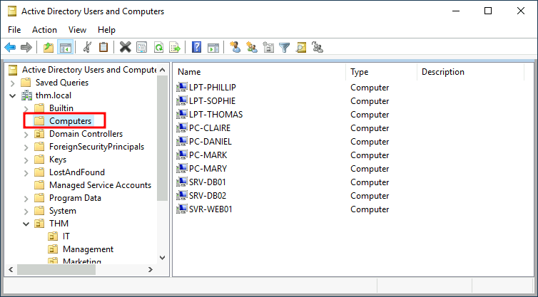
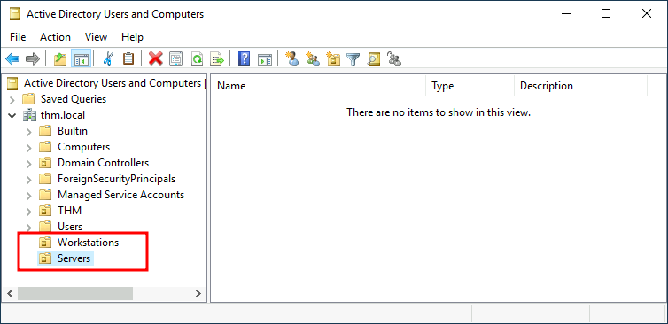

# Managing Computers in AD

This module will be following a practical example of an administrator managing an existing Active Directory

By default, all machines that join a domain (except for the DCs) will be put in the container called "Computers". Checking the DC, there will already be displayed some devices:

There are some servers, laptops and PCs corresponding to the users in the network. Having all of the devices there is not the best idea since it's very likely that different policies will need to be applied for the servers and machines that regular users use on a daily basis.

While there is no golden rule on how to organize the machines, an excellent starting point is segregating devices according to their use. In general, you'd expect to see devices divided into at least the three following categories

### 1.Workstations

Workstations are one of the most common devices within an Active Directory domain. Each user in the domain will likely be logging into a workstation. This is the device they will use to do their work or normal browsing activities. These devices should never have a privileged user signed into them.

### 2.Servers

Servers are the second most common device within an Active Directory domain. Servers are generally used to provide services to users or other servers.

### 3.Domain Controllers

Domain Controllers are the third most common device within an Active Directory domain. Domain Controllers allow you to manage the Active Directory Domain. These devices are often deemed the most sensitive devices within the network as they contain hashed passwords for all user accounts within the environment.

&nbsp;

Let's create in the AD two separate OUs for Workstations and Servers (Domain Controllers are already in a default OU created by Windows). We will be creating the directly under the thm.local domain container. In the end, the AD would have the following OU structure:

Now, we should move the personal computers and laptops to the Workstations OU, and the servers to the Servers OU from the Computers container. Doing so will allow to configure policies for each OU later.