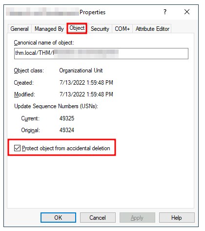

# Managing Users in AD

This module will be following a practical example of an administrator managing an existing Active Directory

Your first task as the new domain administrator is to check the existing AD OUs and users, as some recent changes have happened to the business. You have been given the following organisational chart and are expected to make changes to the AD in order to match it:


&nbsp;

## Deleting Extra OUs and Users


The first thing you should notice is that there is an additional department OU in your current AD configuration that doesn't appear in the chart. We've been told it was closed due to budget cuts and should be removed from the domain. If you try to right-click and delete the OU, you will get the following error:


By default, OUs are protected against accidental deletion. To delete the OU, we need to enable the **Advanced Features** in the View menu:


&nbsp;

This will show  some additional containers and allows to disable the accidental deletion protection. To do so, right-click the OU and go to Properties. You will find aa checkbox in the Object tab to disable protection:



Be sure to uncheck the box and try deleting the OU again. You will be prompted to confirm that you want to delete the OU, and as a result, any users, groups or OUs under it will also be deleted.

After deleting the extra OU, you should notice that for some of the departments, the users in the AD don't match the ones in the organisational chart. Create and delete users as needed to match them.

&nbsp;

## Delegation

One of the nice things you can do in AD is to give specific users some control over some OUs. This process is known as <span style="color: #2dc26b;">delegation</span> and allows you to grant users specific privileges to perform advanced tasks on OUs without needing a Domain Administrator to step in.

One of the most common use cases for this is granting **IT support** privileges to reset other low-privilege user's passwords. According to our organisational chart, Phillip is in charge of the IT support department, so it would probably be necessary to delegate the control of some resources like resetting passwords over the Sales, Marketing and Management OUs to him.

For this example, we will delegate control over the Sales OU to Philip. To delegate control over an OU, you can right-click it and select **Delegate Control**:


This should open a new window  where you will be asked for the users to whom you want to delegate control:

**Note:** to avoid mistyping the user's name, you can write "phillip" and click the **Check Names** button, Windows will autocomplete the user for you.


&nbsp;

Click OK, and the next step, select the following option:


Click next a couple of times, and now Phillip should be able to reset passwords for any user in the Sales department. The same steps can be followed in order to delegate the password resets of the Marketing and Management departments.

Now let's use Phillip's account to try and reset Sophie's password. Here are Phillips's credentials to allow login via RDP:

- Username: phillip
- Password: Claire2008

&nbsp;

While it is logical to try and access the **Active Directory Users and Computers** application in order to try and test Phillip's new permissions, he does not really have the privileges to open it, so you'll have to use other methods to do password resets. In this case, we will be using Powershell to do so:

```Powershell
PS C:\Users\phillip> Set-ADAccountPassword sophie -Reset -NewPassword (Read-Host -AsSecureString -Prompt 'New Password') -Verbose

New Password: *********

VERBOSE: Performing the operation "Set-ADAccountPassword" on target "CN=Sophie,OU=Sales,OU=THM,DC=thm,DC=local".
```

Since we wouldn't want Sophie to keep on using the password we know, we can also force a password reset at the next logon with the following command:

```powershell
PS C:\Users\phillip> Set-ADUser -ChangePasswordAtLogon $true -Identity sophie -Verbose

VERBOSE: Performing the operation "Set" on target "CN=Sophie,OU=Sales,OU=THM,DC=thm,DC=local".
```

&nbsp;